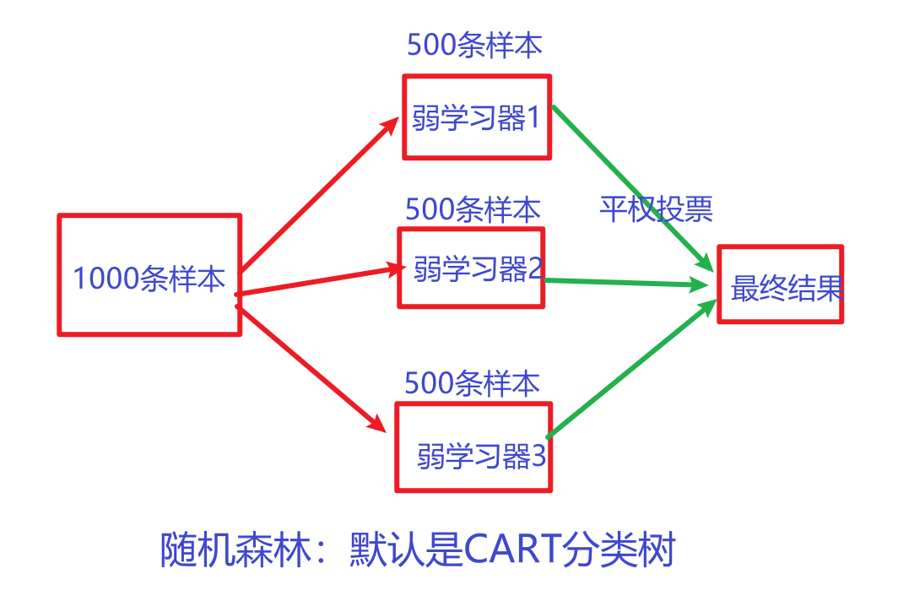
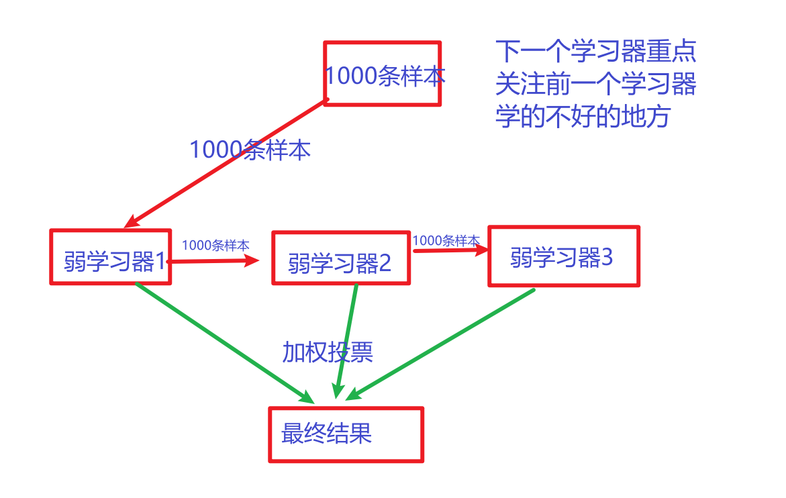
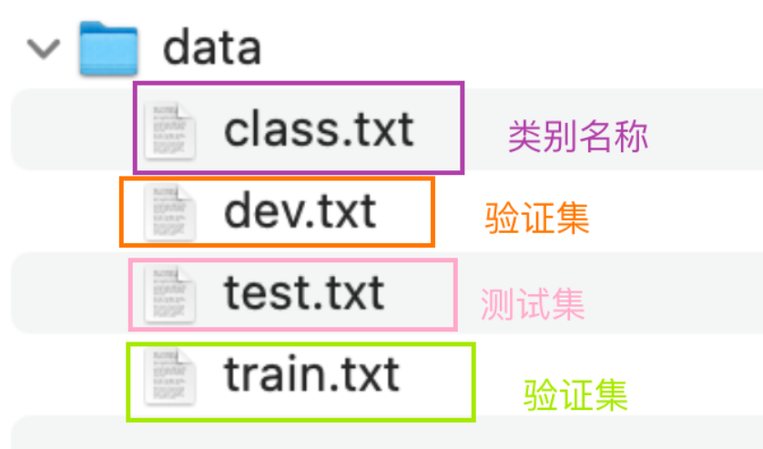

# 项目背景

## 项目背景

- 今日头条项目中的一个功能子集, 完成新闻, 咨询等短文本的多分类, 将各个子类的资料推送到对应的推荐流中.
- 文本分类——>推荐系统


## 集成学习

什么叫集成学习：==三个臭皮匠，顶一个诸葛亮==。一个算法模型做的事情比较简单，上限比较低。集成学习是将多个算法合并起来组成一个功能强大的算法模型。

种类：

* bagging：

  * 数据层面：有放回的随机采样

  * 训练层面：并行训练

  * 结果层面：平权投票

    

* boosting：

  * 数据层面：使用全量样本数据

  * 训练层面：串行训练

  * 结果层面：加权投票

    


## 数据集介绍

- 数据来源
  - 第一类: 公司内部数据部门提供.
    - 情况1: 数据平台有预处理, 提供的是"成品数据".
    - 情况2: 数据平台没有预处理, 只告诉开发人员"数据路径".
    - 情况3: 原始数据就没有, 需要开发人员沟通不同部分, 获取"业务数据".
  - 第二类: 甲方提需求, 并提供数据.
    - 情况1: 甲方有预处理数据, 提供的基本是"半成品数据".
    - 情况2: 甲方只负责"埋点", 后续数据需要开发人员处理.
    - 情况3: 甲方数据"匮乏", 甚至数据"缺失".
  - 第三类: 需求画大饼阶段, 没有数据, 没有GPU, 只有"蓝图"和"展望".

- 本项目数据集属于预标注好的数据，属于第一类



### 训练集数据

```shell
02-data/data/train.txt
```

共180000条.

```shell
中华女子学院：本科层次仅1专业招男生     3
两天价网站背后重重迷雾：做个网站究竟要多少钱    4
东5环海棠公社230-290平2居准现房98折优惠 1
卡佩罗：告诉你德国脚生猛的原因 不希望英德战踢点球       7
82岁老太为学生做饭扫地44年获授港大荣誉院士      5
记者回访地震中可乐男孩：将受邀赴美国参观        5
冯德伦徐若�隔空传情 默认其是女友        9
传郭晶晶欲落户香港战伦敦奥运 装修别墅当婚房     1
《赤壁OL》攻城战诸侯战硝烟又起  8
“手机钱包”亮相科博会    4
上海2010上半年四六级考试报名4月8日前完成        3
李永波称李宗伟难阻林丹取胜 透露谢杏芳有望出战   7
金证顾问：过山车行情意味着什么  2
谁料地王如此虚  1
《光环5》Logo泄露 Kinect版几无悬念      8
海淀区领秀新硅谷宽景大宅预计10月底开盘  1
柴志坤：土地供应量不断从紧 地价难现07水平(图)   1
伊达传说EDDA Online     8
三联书店建起书香巷      4
宇航员尿液堵塞国际空间站水循环系统      4
研究发现开车技术差或与基因相关  6
皇马输球替补席闹丑闻 队副女球迷公然调情(视频)   7
北京建工与市政府再度合作推出郭庄子限价房        1
组图：李欣汝素颜出镜拍低碳环保大片      9
```

train.txt中包含180000行样本, 每行包括两列, 第一列为待分类的中文文本, 第二列是数字化标签, 中间用\t作为分隔符.

### 测试集数据

```shell
02-data/data/test.txt
```

test.txt中包含10000行样本, 每行包括两列, 第一列为待分类的中文文本, 第二列是数字化标签, 中 间用\t作为分隔符.

### 验证集数据

```shell
02-data/data/dev.txt
```

dev.txt中包含10000行样本, 每行包括两列, 第一列为待分类的中文文本, 第二列是数字化标签, 中 间用\t作为分隔符.

### 类别集合数据

```shell
02-data/data/class.txt
```

共10条.

```python
finance
realty
stocks
education
science
society
politics
sports
game
entertainment
```

class.txt中包含10个类别标签, 每行一个标签, 为英文单词的展示格式.


## 数据集分析（掌握）

### 配置文件

定义配置类, 用来集中管理项目中所有数据文件的路径。采用类的形式类管理, 可以提高代码的可维护性, 以便统一的修改和调用

~~~python
# 把常用的变量值放在类中。目的是为了方便使用

class Config:
    def __init__(self):
        # 1- 训练集文件路径
        self.train_datapath = "../data/train.txt"
        # 2- 测试集文件路径
        self.test_datapath = "../data/test.txt"
        # 3- 验证集文件路径
        self.dev_datapath = "../data/dev.txt"

if __name__ == '__main__':
    config = Config()
    print(config.train_datapath)
~~~


### 数据探索EDA

EDA：探索性数据分析(Exploratory Data Analysis), 是一种分析数据集以总结其主要特征, 一般和图形表示法结合使用.
大白话：就是分析数据的, 可以帮我们发现模式, 检测异常, 测试假设, 从而对数据集有一个直观的了解

~~~python
# 数据探索：目的是为了让自己对数据的内容、含义、分布理解的更加清楚

import pandas as pd
from config import Config
from collections import Counter
import matplotlib.pyplot as plt

# 1- 获得配置信息
config = Config()
datapath = config.train_datapath
datapath = config.test_datapath

if __name__ == '__main__':
    # 2- 读取文件内容
    """
        参数解释：
            sep：字段值之间的分隔符
            names：自定义字段名称。如果原始文件中也有字段名称，会用names覆盖掉文件中的
    """
    df = pd.read_csv(datapath,sep="\t",encoding="UTF-8",names=["text","label"])
    # print(df.head())


    # 3- 统计目标值的分布情况
    # 3.1- 统计每种目标值的样本条数
    label_counts = Counter(df["label"])
    # print(label_counts)

    # 3.2- 统计每种目标值的样本条数占比
    total_count = df["label"].size  # 总样本条数
    for label,cnt in label_counts.items():
        rate = cnt*100/total_count
        print(f"目标值={label}，条数：{cnt}，占比：{rate}%")

    # 4- 句子长度分布
    # 4.1- 统计每条句子的长度
    df["length"] = df["text"].str.len()
    print(df.head())

    # 4.2- 最长、最短、均值、中位数等的统计
    print("句子最大长度：",df["length"].max())
    print("句子最短长度：",df["length"].min())
    print("句子均值长度：",df["length"].mean())
    print("句子中位数长度：",df["length"].median())

    # 4.3- 绘制直方图
    df["length"].hist()
    plt.show()
~~~
