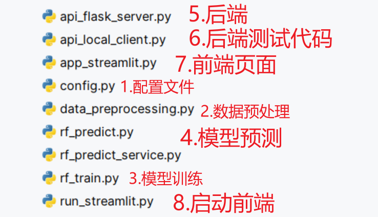
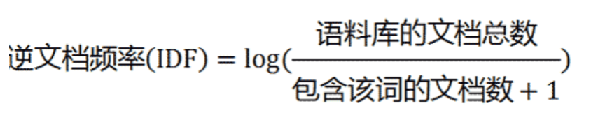
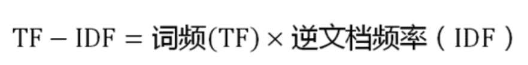
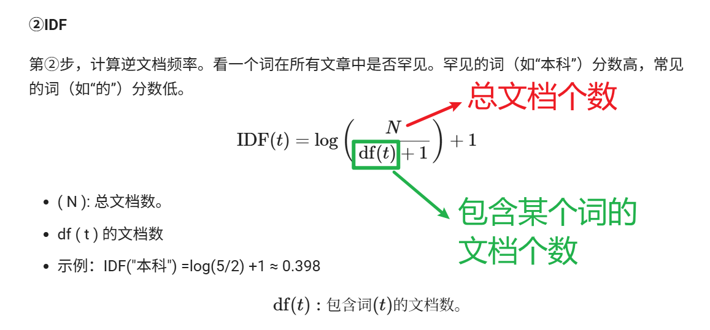
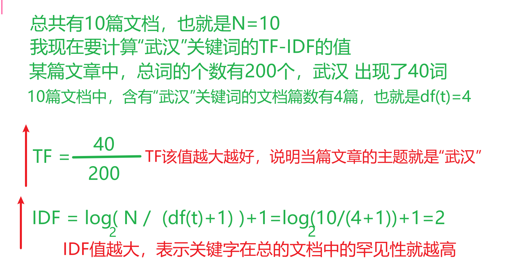
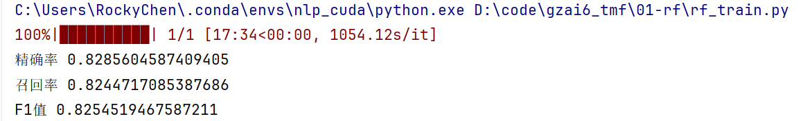

# 随机森林实现

## 代码结构图



## 配置文件类

代码文件名称：config.py


~~~python
class Config():
    # 1. 初始化函数.
    def __init__(self):
        # 原始文件的路径.
        # 1.1 训练数据路径
        self.train_datapath = "../01-data/data/train.txt"
        # 1.2 测试数据路径
        self.test_datapath = "../01-data/data/test.txt"
        # 1.3 验证数据路径
        self.dev_datapath = "../01-data/data/dev.txt"
        # 1.4 类别数据路径
        self.class_datapath = "../01-data/data/class.txt"
        # 1.5 停用词数据路径
        self.stop_words_path = "../01-data/data/stopwords.txt"

        # 2. 保存处理后的文件信息.
        self.process_train_path = "./data/process_train_data.csv"
        self.process_test_path = "./data/process_test_data.csv"
        self.process_dev_path = "./data/process_dev_data.csv"

        # 3. 模型保存的路径.
        self.rf_model_save_path = "./save_model/rf_model.pkl"
        self.tfidf_model_save_path = "./save_model/tfidf_model.pkl"

        # 保存模型预测的结果.
        self.model_predict_result = './result/predict_result.txt'
~~~


## 数据预处理

代码文件名称：data_preprocessing.py


~~~python
# 数据预处理：将一条句子分词得到一个个的词

import pandas
import jieba
import pandas as pd

from config import Config

# 1- 加载配置文件
config = Config()

def preprocessing(datapath):
    # 1- 读取对应的文件
    df = pd.read_csv(datapath,sep="\t",encoding="UTF-8",names=["text","label"])

    # 2- 对text句子进行分词，并且只取前30个词
    """
        代码解释：
            jieba.lcut(line)：对句子分词得到List列表，里面放的是一个个词
            jieba.lcut(line)[:30]：对上面的List列表进行切片，只保留前30个词
            " ".join(jieba.lcut(line)[:30])：将List列表中的元素以空格隔开存储到DF中
    """
    df["words"] = df["text"].apply(lambda line: " ".join(jieba.lcut(line)[:30]))
    # print(df.head())

    # 3- 将处理后的DF写入文件进行存储
    """
        to_csv参数解释：
            header：是否将字段名称作为第一行写入到文件中。推荐设置为True
            index：是否将DF中的索引写入到文件中。如果index有业务层面的含义，推荐设置为True；否则就是False
            mode：文件的写入模式。这里是为了防止代码重复跑，然后数据出现重复的问题，因此设置为覆盖写w
    """
    # 3.1- 训练集
    if "train" in datapath:
        df.to_csv(config.process_train_datapath,sep=",",header=True,index=False,mode="w",encoding="UTF-8")
        print("train数据预处理完成，保存成功")

    # 3.2- 测试集
    if "test" in datapath:
        df.to_csv(config.process_test_datapath, sep=",", header=True, index=False, mode="w", encoding="UTF-8")
        print("test数据预处理完成，保存成功")

    # 3.1- 训练集
    if "dev" in datapath:
        df.to_csv(config.process_dev_datapath, sep=",", header=True, index=False, mode="w", encoding="UTF-8")
        print("dev数据预处理完成，保存成功")

def preprocessing_plus(task_type,datapath):
    # 1- 读取对应的文件
    df = pd.read_csv(datapath,sep="\t",encoding="UTF-8",names=["text","label"])

    # 2- 对text句子进行分词，并且只取前30个词
    df["words"] = df["text"].apply(lambda line: " ".join(jieba.lcut(line)[:30]))

    # 3- 将处理后的DF写入文件进行存储
    if task_type in datapath:
        df.to_csv(config.process_datapath_dict.get(task_type),sep=",",header=True,index=False,mode="w",encoding="UTF-8")
        print(f"{task_type}数据预处理完成，保存成功")

if __name__ == '__main__':
    # 2- 获得训练集、测试集、验证集的数据路径；调用数据预处理函数
    # ------------------ 普通版写法 ------------------
    # 2.1- 训练集的处理
    # datapath = config.train_datapath
    # preprocessing(datapath)
    #
    # # 2.2- 测试集的处理
    # datapath = config.test_datapath
    # preprocessing(datapath)
    #
    # # 2.3- 验证集的处理
    # datapath = config.dev_datapath
    # preprocessing(datapath)

    # ------------------ 优化版写法 ------------------
    for task_type,datapath in config.original_datapath_dict.items():
        preprocessing_plus(task_type,datapath)
~~~


## TF-IDF介绍

 TF-IDF（term frequency–inverse document frequency，词频-逆文档频率）是一种用于信息检索（information retrieval）与文本挖掘（text mining）的常用加权技术。它由两部分组成，TF 和 IDF。

 第一步，计算词频。


考虑到文章有长短之分，为了便于不同文章的比较，进行 “词频” 标准化（归一化）。


第二步，计算逆文档频率。这时，需要一个语料库（corpus），用来模拟语言的使用环境。



如果一个词越常见，那么分母就越大，逆文档频率就越小越接近0。分母之所以要加1，是为了避免分母为0（即所有文档都不包含该词）。log表示对得到的值取对数。

第三步，计算TF-IDF。



TF-IDF 是一种统计方法，用以评估一字词对于一个文件集或一个语料库中的其中一份文件的重要程度。**字词的重要性随着它在文件中出现的次数的增加成正比增加，但同时会随着它在语料库中出现的频率成反比下降。**

TF-IDF 的主要思想是：如果某个单词在一篇文章中出现的频率 TF 高，并且在其他文章中很少出现，则认为此词或者短语具有很好的类别区分能力，适合用来分类。






具体实现如下所示：

```python
# 读取停用词
stop_words = open(STOP_WORDS).read().split()
# 计算tfidf特征
tfidf = TfidfVectorizer(stop_words=stop_words)
text_vectors = tfidf.fit_transform(corpus)
```


## 模型训练

代码文件名称：rf_train.py


~~~python
import pandas as pd
from config import Config
from sklearn.feature_extraction.text import TfidfVectorizer # TF-IDF类
from sklearn.model_selection import train_test_split
from sklearn.ensemble import RandomForestClassifier # 随机森林
from tqdm import tqdm
from sklearn.metrics import precision_score,recall_score,f1_score
import pickle   # 专门读写pickle类型的文件

# 1- 基础配置信息
config = Config()

if __name__ == '__main__':
    # 2- 读取预处理后的文件
    # 2.1- 读取文件
    # [:2000]：只取前2000行数据，为了加快代码开发和测试的速度。注意：正式上线之前，要删掉
    # df = pd.read_csv(config.process_train_datapath)[:2000]
    df = pd.read_csv(config.process_train_datapath)

    # 2.2- 获取特征和目标值
    words = df["words"]
    y = df["label"]

    # 3- 特征数据转词向量
    # 3.1- 创建TF-IDF算法模型实例对象
    # 读取停止词
    stop_word_list = open(config.stopwords_datapath,encoding="UTF-8").read().split()
    tfidf = TfidfVectorizer(stop_words=stop_word_list)
    # 模型训练，并且对数据转成词向量
    x = tfidf.fit_transform(words)

    # 3.2- 输出相关信息
    # print("处理后的特征名称列表",tfidf.get_feature_names_out())
    # print("处理后的词和索引映射关系",tfidf.vocabulary_)
    # print("处理后的词和索引的条数：也就是词汇表大小",len(tfidf.vocabulary_))

    """
        TF-IDF处理后的数据解释：
            Coords	Values
            (0, 818)	0.4145423492151699
            
            1- 0：代表该词所在的句子索引
            2- 818：代表该词的词索引
            3- 0.4145423492151699：TF-IDF的值
    """
    # print(x)

    # 4- 划分训练集和测试集
    x_train,x_test,y_train,y_test = train_test_split(x,y,test_size=0.2,random_state=114)

    # 5- 模型训练
    model = RandomForestClassifier(n_jobs=-1)
    model.fit(x_train,y_train)

    # 6- 评估
    y_pred = model.predict(x_test)
    """
        average参数解释：
            1- binary：针对二分类场景
            2- macro：宏观。多分类场景，样本分布均衡的场景
            3- micro：微观。多分类场景，样本分布不均衡的场景
    """
    print("精确率",precision_score(y_test, y_pred, average="macro"))
    print("召回率",recall_score(y_test, y_pred, average="macro"))
    print("F1值",f1_score(y_test, y_pred, average="macro"))


    # 7- 保存训练好的模型：推荐使用joblib.dump()
    with open(config.tfidf_model_path,mode="wb") as f:
        pickle.dump(tfidf,f)

    with open(config.rf_model_path,mode="wb") as f:
        pickle.dump(model,f)
~~~

运行结果：




## 模型预测

代码文件名称：rf_predict.py


~~~python
import pandas as pd
import pickle
from config import Config
from sklearn.feature_extraction.text import TfidfVectorizer # TF-IDF类
from sklearn.ensemble import RandomForestClassifier # 随机森林
from sklearn.metrics import precision_score,recall_score,f1_score

config = Config()

if __name__ == '__main__':
    # 1- 读取验证集数据
    df = pd.read_csv(config.process_dev_datapath,encoding="UTF-8")
    # 获得特征和目标值
    words = df["words"]
    y = df["label"]

    # 2- 加载训练好的模型
    with open(config.rf_model_path,mode="rb") as f:
        model:RandomForestClassifier = pickle.load(f)

    with open(config.tfidf_model_path,mode="rb") as f:
        tfidf:TfidfVectorizer = pickle.load(f)

    # 3- 对数据集中words进行TF-IDF的处理
    x = tfidf.transform(words)

    # 4- 预测
    y_pred = model.predict(x)

    # 5- 输出指标
    print("预测的精确率：",precision_score(y,y_pred,average="macro"))
    print("预测的召回率：",recall_score(y,y_pred,average="macro"))
    print("预测的F1值：",f1_score(y,y_pred,average="macro"))

    # 6- 将预测结果作为新字段放到DF中，然后写出成文件
    df["pred"] = y_pred
    df.to_csv(config.predict_result_path,sep="\t",index=False,header=True)
~~~


## 模型部署

* 预测方法：供接口调用

代码文件名称：rf_predict_fun.py

~~~python
import jieba
import pickle
from config import Config
from sklearn.feature_extraction.text import TfidfVectorizer # TF-IDF类
from sklearn.ensemble import RandomForestClassifier # 随机森林

# 1- 加载配置文件
config = Config()

# 2- 加载训练好的模型
with open(config.rf_model_path,mode="rb") as f:
    model:RandomForestClassifier = pickle.load(f)

with open(config.tfidf_model_path,mode="rb") as f:
    tfidf:TfidfVectorizer = pickle.load(f)

# 3- 对单条新闻标题进行预测
def predict(news_data):
    """
    对单条新闻标题进行预测
    :param news_data: 字典数据类型。结构：{"title":新闻标题内容}
    :return: 字典。结构：{"title":新闻标题内容,"pred_class":预测的新闻类型}
    """

    # 1- 取出新闻标题；分词；取前30个词；以空格分隔
    words = " ".join(jieba.lcut(news_data["title"])[:30])

    # 2- TF-IDF进行处理
    x = tfidf.transform([words])

    # 3- 预测
    y_pred_index = model.predict(x)[0]
    # print(y_pred_index)

    # 4- 读取class.txt文件。处理成字典。字典格式 {0:'finance', 1:'realty'....}
    id_class_dict = {i:class_name.strip() for i,class_name in enumerate(open(config.class_datapath,mode="r",encoding="UTF-8"))}
    # print(id_class_dict)

    # 5- 通过预测结果ID获得分类名称
    pred_class_name = id_class_dict[y_pred_index]

    news_data["pred_class"] = pred_class_name

    return news_data

if __name__ == '__main__':
    news_data = {"title":"同步A股首秀：港股缩量回调"}
    result = predict(news_data)

    print(result)
~~~


* 服务端

代码文件名称：api_flask_server.py

~~~python
# pip install flask
from flask import Flask,request,jsonify
from rf_predict_service import predict

# 1- 创建Application应用对象
app = Flask(__name__)

# API application process interface：URL地址，交换数据
# 2- 创建预测的后端API接口
"""
    POST和GET的区别：
        1- 安全性：POST相对GET要安全些
        2- 数据量：POST传输的数据量比GET要多
        3- 参数位置：GET在URL的后面，POST参数在表单中
"""
@app.route(rule="/predict_api",methods=["POST"])
def predict_api():
    # 1- 获取用户输入的参数信息
    news_data = request.get_json()
    # print(f"用户发送过来的请求参数内容：{news_data}，类型是：{type(news_data)}")

    # 2- 调用模型预测方法
    result = predict(news_data)

    # 3- 返回预测结果给用户：将Python中的字典转成JSON字符串返回给用户
    return jsonify(result)

if __name__ == '__main__':
    # 启动后端程序
    """
       参数解释：
            host：程序运行的服务器IP地址
            port：程序绑定到服务器的什么端口号上。推荐设置范围是1024-65535之间 
    """
    app.run(host="192.168.106.58",port=8888,debug=True)
~~~


* 客户端：测试使用

代码文件名称：api_local_client.py

~~~python
import requests

if __name__ == '__main__':
    while True:
        # 1- 获取用户输入的新闻标题
        title = input("请输入新闻标题：")
        if title=="exit":
            break

        # 2- 发送请求
        url = "http://192.168.106.58:8888/predict_api"
        response = requests.post(url,json={"title":title})

        # 3- 输出响应结果
        print("响应结果是：",response.json())
~~~


> **注：ip地址通过ipconfig 或者 ifconfig查看**


## 前端页面

* 页面代码

代码文件名称：app_streamlit.py

~~~python
# pip install streamlit
import streamlit as st
import requests
import time

if __name__ == '__main__':
    # 1- 创建页面
    st.title("投满分项目")
    st.write("这是一个投满分项目")

    # 2- 获取用户输入的内容
    title = st.text_input("请输入新闻标题")

    # 3- 发送
    url = "http://192.168.106.58:8888/predict_api"
    if st.button("提交"):
        start_time = time.time()

        try:
            response = requests.post(url, json={"title": title})
            result = response.json()["pred_class"]
            use_time = time.time() - start_time

            st.write(f"耗时：{round(use_time, 3)}s")
            st.write(f"新闻分类预测结果是：{result}")
        except Exception as e:
            st.write("网络波动，错误码是：666，请联系人工客服：020-119")
~~~


* 启动文件：用于启动 run_streamlit 网页

代码文件名称：run_streamlit.py

~~~python
# 专门用来启动streamlit的前端页面
import os
# os.system(需要执行的命令)
# 注意：相对路径需要改成你自己的
os.system(r"streamlit run app_streamlit.py")
~~~

> **注：路径改成自己的**