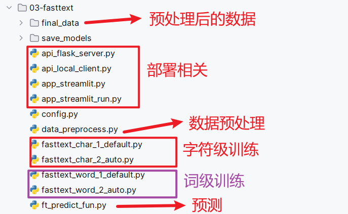

# Fasttext实现

~~~properties
4种实现方式的区别：
	1- 随机森林
		机器学习的方式。代码开发、模型训练等非常简单；因为模型比较简单，所以预测准确率一般般
		工作中拿到需求以后，短时间内想要快速看到效果，用该方式
		
	2- Fasttext
		它实际就是个简单的深度学习网络模型，内部结构：输入层、一层隐藏层、输出层。
		工作中拿到需求以后，短时间内想要快速看到效果，而且想以深度学习的方式实现，用该方式
		
	3- Bert
		Bert的网络结构、参数量比上面的两种都要复杂。也就是代码开发量、训练耗时等都要复杂一些，但是能够进行非常丰富的模型调优。
		如果想要达到比较高的准确率，同时开发时间比较充裕，就用该方式
		
	4- LLM大模型
		如果只想通过写提示词的方式快速实现
~~~


## 代码结构图




## 配置文件类

~~~python
# 该py脚本中 主要封装的是 原始数据路径(5个), 处理后的数据路径(6个), 模型保存路径(1, 父目录), 类别字典(1个)
class Config:
    def __init__(self):
        # 1.项目根目录
        self.root_path = 'C:/Users/RockyChen/Desktop/新建文件夹/02-代码/TMF_Project/'

        # 2.原始数据路径
        self.train_datapath = self.root_path + '01-data/data/train.txt'
        self.test_datapath = self.root_path + '01-data/data/test.txt'
        self.dev_datapath = self.root_path + '01-data/data/dev.txt'
        # 类别文档
        self.class_doc_path = self.root_path + "01-data/data/class.txt"

        # 3.数据处理保存路径
        # 字符级别fasttext
        self.process_train_datapath_char = "final_data/train_process_char.txt"
        self.process_test_datapath_char = "final_data/test_process_char.txt"
        self.process_dev_datapath_char = "final_data/dev_process_char.txt"

        # 词级别fasttext
        self.process_train_datapath_word = "final_data/train_process_word.txt"
        self.process_test_datapath_word = "final_data/test_process_word.txt"
        self.process_dev_datapath_word = "final_data/dev_process_word.txt"

        # 4.模型路径
        self.ft_model_save_path = 'save_models'

        # 5.处理完的数据（用于训练）
        self.final_data = 'final_data'

        # 6.类别字典, 格式为: {0: 'business', 1: 'entertainment', 2: 'sports', 3: 'tech'...}
        self.id2class_dict = {i:line.strip() for i, line in enumerate(open(self.class_doc_path))}


# 测试代码
if __name__ == '__main__':
    config = Config()
    print(config.train_datapath)

    # {0: 'finance', 1: 'realty', 2: 'stocks', 3: 'education', 4: 'science', 5: 'society', 6: 'politics', 7: 'sports',
    # 8: 'game', 9: 'entertainment'}
    print(config.id2class_dict)
~~~

> **注意：上面配置文件中的路径，全部改成自己的。特别是注意root_path**


## 数据预处理

使用 fastText 工具解决文本分类任务时，存放数据集的文本文件必须满足以下两个条件：

- 文本文件中的每一行对应一个文档；
- 文档的类别标签以 `__label__name` 为前缀放在文档的最前面；

下面举两个符合条件的小例子。

单标签数据集：

```
__label__1 i love you
__label__0 i hate you
```

上面的单标签数据集中一共有 2 个文档（每一行一个文档），第一个文档 "i love you"，对应的类别标签为 1（具体类别名为 前缀后面的文本），第二个文档 "i hate you"，对应的类别标签为 0。

多标签数据集：

```
__label__baking __label__food-safety __label__substitutions __label__peanuts how to seperate peanut oil from roasted peanuts at home?
__label__chocolate American equivalent for British chocolate terms
__label__baking __label__oven __label__convection Fan bake vs bake
__label__sauce __label__storage-lifetime __label__acidity __label__mayonnaise Regulation and balancing of readymade packed mayonnaise and other sauces
```

多标签数据集中的不同的类别标签用空格来分割。比如：对于 "Regulation and balancing of readymade packed mayonnaise and other sauces" 文档的类别标签有 sauce、storage-lifetime、acidity 和 mayonnaise 5 个。

**单标签和多标签数据集在 fastText 的使用上并没有区别 **

所以需要将数据处理成上述形式。


~~~python
"""
    数据预处理要求：
        原始数据：今天天气真的很好,8
        处理后数据：__label__game 今天 天气 真的 很好
"""
import jieba
from config import Config
config = Config()


def preprocessing(datapath, process_datapath, is_char=True):
    """
    FastText中有监督学习的数据预处理
    :param datapath: 原始文件路径
    :param process_datapath: 预处理后的文件路径
    :param is_char: 是否是字级别的处理，默认True，也就是字级别。False使用jieba分词，词级别
    :return: None
    """

    # 1- 读取原始文件内容
    with open(datapath,mode="r",encoding="UTF-8") as f:
        lines = f.readlines()

    # 2- 预处理
    with open(process_datapath, mode="w", encoding="UTF-8") as f:
        # 2.1- 遍历原始文件内容
        for line in lines:
            # 去除空行
            # 注意：需要先执行strip()，避免空行中有空格的情况
            line = line.strip()
            if line=="":
                continue

            # 2.2- 拆分得到新闻标题和目标值
            title,label = line.split("\t")

            # 2.3- 对新闻标题进行处理
            if is_char:
                title = " ".join(list(title))
            else:
                title = " ".join(jieba.lcut(title))

            # 2.4- 对目标值进行处理
            # 字符串类型转成数字
            label = int(label)
            # 通过key获取对应的类别名称
            label_name = config.id2label[label]

            # 2.5- 目标值和新闻标题拼接成如下的格式
            # __label__目标值 处理后的新闻标题
            new_line = f"__label__{label_name} {title}\n"

            # 2.6- 写入到新文件中
            f.write(new_line)

if __name__ == '__main__':
    # 字符级
    preprocessing(datapath=config.train_datapath, process_datapath=config.process_char_train_datapath, is_char=True)
    preprocessing(datapath=config.dev_datapath, process_datapath=config.process_char_dev_datapath, is_char=True)
    preprocessing(datapath=config.test_datapath, process_datapath=config.process_char_test_datapath, is_char=True)

    # 词级
    preprocessing(datapath=config.train_datapath, process_datapath=config.process_word_train_datapath, is_char=False)
    preprocessing(datapath=config.dev_datapath, process_datapath=config.process_word_dev_datapath, is_char=False)
    preprocessing(datapath=config.test_datapath, process_datapath=config.process_word_test_datapath, is_char=False)
~~~


## 模型训练

### 字符级训练

#### 手动指定参数

~~~python
import fasttext
from config import Config

config = Config()

"""
    使用Fasttext实现如下四种模型训练：
        1- 字符级
            1.1- 手动设置超参数 char_manual_train
            1.2- 自动调整超参数 char_auto_train
            
        2- 词级
            2.1- 手动设置超参数 word_manual_train
            2.2- 自动调整超参数 word_auto_train
"""

def char_manual_train():
    # 1- 模型训练：有监督学习
    """
        参数解释：
            dim：词向量维度
            epoch：训练轮次
            minn、maxn：是n-gram中n的取值范围，左右都是闭区间。不管你输入进来的是啥，先在内容的前后增加<>，然后再分词
    """
    model = fasttext.train_supervised(
        input=config.process_char_train_datapath,
        dim=100,
        epoch=50,
        minn=1,
        maxn=4
    )

    # 2- 保存训练好的模型
    model.save_model(config.model_char_manual_train)

    # 3- 模型评估
    # test返回值解释：样本条数、精确率、召回率
    result = model.test(config.process_char_test_datapath)
    print(f"字符级_手动设置超参数_评估结果：{result}")

    # 4- 其他操作
    # 4.1- 使用训练好的模型进行预测
    pred_result = model.predict("房 山 纯 新 盘 绿 地 新 都 会 国 际 花 都 1 1 月 开 盘")
    print(f"预测结果：{pred_result}")

    # 4.2- 查看模型词表信息
    words = model.words
    print(type(words))  # List列表
    print(len(words))
    print(words[:10])

    # 4.3- 子词：查看minn和maxn的作用
    print("子词",model.get_subwords("ab"))

    # 4.4- 词的维度
    print("词的维度",model.get_dimension())
~~~


#### 参数自动调优

~~~python
def char_auto_train():
    # 1- 模型训练
    """
        参数解释：
            verbose：用来控制自动调参过程中日志的展示级别。该值越大，信息越丰富
    """
    model = fasttext.train_supervised(
        input=config.process_char_train_datapath,
        autotuneValidationFile=config.process_char_dev_datapath,
        autotuneDuration=3*60,
        seed=115,
        verbose=3
    )

    # 2- 保存训练好的模型
    model.save_model(config.model_char_auto_train)

    # 3- 评估
    result = model.test(config.process_char_test_datapath)
    print(f"字符级_自动设置超参数_评估结果：{result}")
~~~


### 词级训练

#### 手动指定参数

~~~python
def word_manual_train():
    # 1- 模型训练：有监督学习
    model = fasttext.train_supervised(
        input=config.process_word_train_datapath,
        dim=100,
        epoch=50,
        minn=1,
        maxn=4
    )

    # 2- 保存训练好的模型
    model.save_model(config.model_word_manual_train)

    # 3- 模型评估
    # test返回值解释：样本条数、精确率、召回率
    result = model.test(config.process_word_test_datapath)
    print(f"词级_手动设置超参数_评估结果：{result}")

    # 4- 子词：查看minn和maxn的作用
    print("子词", model.get_subwords("人工智能"))
~~~


#### 参数自动调优

~~~python
def word_auto_train():
    # 1- 模型训练
    model = fasttext.train_supervised(
        input=config.process_word_train_datapath,
        autotuneValidationFile=config.process_word_dev_datapath,
        autotuneDuration=3 * 60,
        seed=115,
        verbose=3
    )

    # 2- 保存训练好的模型
    model.save_model(config.model_word_auto_train)

    # 3- 评估
    result = model.test(config.process_word_test_datapath)
    print(f"词级_自动设置超参数_评估结果：{result}")
~~~


#### 测试代码

~~~python
if __name__ == '__main__':
    # 1- 字符级
    # 手动设置超参数
    # 字符级_手动设置超参数_评估结果：(10000, 0.8714, 0.8714)
    char_manual_train()

    # 自动调整超参数
    # 字符级_自动设置超参数_评估结果：(10000, 0.873, 0.873)
    char_auto_train()

    # 2- 词级
    # 手动设置超参数
    # 词级_手动设置超参数_评估结果：(10000, 0.9103, 0.9103)
    word_manual_train()

    # 自动调整超参数
    # 词级_自动设置超参数_评估结果：(10000, 0.9143, 0.9143)
    word_auto_train()
~~~


## 模型预测

~~~python
from config import Config
import fasttext
import jieba

config = Config()

# 1- 加载训练好的模型：因为词级的模型效果最好
model = fasttext.load_model(config.model_word_auto_train)

# 2- 预测函数
def predict(news_data):
    """
    对用户输入的新闻标题进行分类预测
    :param news_data: 字典。格式：{"title":新闻标题}
    :return: 字典。格式：{"title":新闻标题, "pred_class":分类预测结果名称}
    """
    # 1- 【可选】增加健壮性的代码
    if not news_data.__contains__("title"):
        news_data["error"] = "传递的参数中没有title字段"
        return news_data

    # 2- 取出新闻标题；数据预处理，也就是分词
    title = " ".join(jieba.lcut(news_data["title"]))

    # 3- 预测
    # 返回值类型是嵌套元组。格式：(('__label__science',), array([0.81338769]))
    pred_result = model.predict(title)
    # print(type(pred_result))
    # print(pred_result)

    # 4- 取出预测结果
    result = pred_result[0][0].replace("__label__","")

    # 5- 返回结果
    news_data["pred_class"] = result
    return news_data

if __name__ == '__main__':
    # news_data = {"title":"体验2D巅峰 倚天屠龙记十大创新概览"}
    news_data = {"aaaa":"体验2D巅峰 倚天屠龙记十大创新概览"}
    result = predict(news_data)
    print(result)
~~~


## 模型部署

代码几乎与随机森林的相同。唯一的地方是将

```python
from rf_predict_service import predict

改为

from ft_predict_service import predict
```


