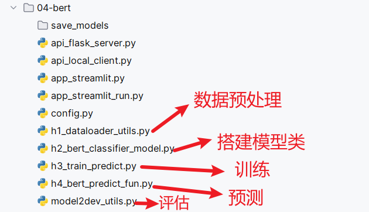
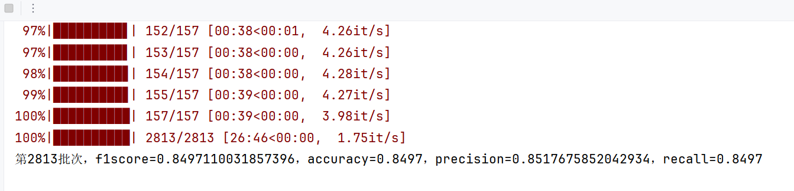

# Bert实现

## 代码结构图




## 配置文件类

~~~python
import torch            # 用于深度学习模型的构建和训练

# 导入Bert相关组件, BertModel(BERT模型的主体), BertTokenizer(BERT的分词器), BertConfig(BERT的配置)
from transformers import BertModel, BertTokenizer, BertConfig

# 定义配置文件类, 集中管理 模型和训练所需的参数.
class Config:
    def __init__(self):
        """
        配置类，包含模型和训练所需的各种参数。
        """

        # 1. 基础的模型信息, 例如: 模型名称
        self.model_name = "bert"  # 模型名称

        # 2. 路径配置.
        # 根目录
        self.root_path = 'C:/Users/RockyChen/Desktop/新建文件夹/02-代码/TMF_Project/'
        
        # 原始数据路径
        self.train_datapath = self.root_path + '01-data/data/train.txt'
        self.test_datapath = self.root_path + '01-data/data/test.txt'
        self.dev_datapath = self.root_path + '01-data/data/dev.txt'
        # 类别文档
        self.class_path = self.root_path + "01-data/data/class.txt"

        # 从类别文件中读取所有类别的名称.
        self.class_list = [line.strip() for line in open(self.class_path, encoding="utf-8")]  # 类别名单

        # 模型训练保存路径
        self.model_save_path = "save_models/bert_classifier_model.pt"  # 模型训练结果保存路径

        # 模型训练+预测的时候, 指定设备
        self.device = torch.device("cuda" if torch.cuda.is_available() else "cpu")  # 训练设备，如果GPU可用，则为cuda，否则为cpu


        # 3. BERT模型的相关配置.
        self.bert_path = "bert-base-chinese"  # 预训练BERT模型的路径
        self.bert_model = BertModel.from_pretrained(self.bert_path) # 加载预训练BERT模型
        self.tokenizer = BertTokenizer.from_pretrained(self.bert_path)  # BERT模型的分词器
        self.bert_config = BertConfig.from_pretrained(self.bert_path)  # BERT模型的配置


        # 4. 训练参数配置.
        self.num_classes = len(self.class_list)  # 类别数
        self.num_epochs = 2  # epoch数
        self.batch_size = 64  # mini-batch大小
        self.pad_size = 32    # 每句话处理成的长度(短填长切)
        self.learning_rate = 5e-5  # 学习率

# 3.主函数
if __name__ == '__main__':
    # 1. 创建Config类的对象, 加载所有配置参数
    conf = Config()

    # 2. 打印设备信息(GPU/CPU)
    print(conf.device)

    # 3. 打印类别列表
    print(conf.class_list)

    # 4. 查看保存模型的路径.
    print(conf.model_save_path)

    # 5. 打印分词器对象(验证分词器是否成功加载)
    print(conf.tokenizer)

    # 需求: 测试分词器的 token转id功能, 将: ['你', '好', '文', '俊'] 转换为对应的id
    my_input_ids = conf.tokenizer.convert_tokens_to_ids(['你', '好', '文', '俊'])
    print(my_input_ids)     # [872, 1962, 3152, 916]
~~~


## 数据预处理

### 加载并处理原始数据集

~~~python
import torch
from tqdm import tqdm
from config import Config
from torch.utils.data import Dataset,DataLoader
from transformers import BertTokenizer
from transformers import BertModel
from transformers import BertConfig

# 1- 公共变量
config = Config()
bert_tokenizer = BertTokenizer.from_pretrained(config.bert_path)
bert_model = BertModel.from_pretrained(config.bert_path)
bert_config = BertConfig.from_pretrained(config.bert_path)

def load_raw_file(datapath):
    """
    加载并处理原始文件
    :param datapath: 原始文件路径
    :return: 处理后的文件，新闻标题string，目标值是int。格式：[(新闻标题,目标值),(新闻标题,目标值)...]
    """

    # 1- 读取原始文件内容
    with open(datapath,mode="r",encoding="UTF-8") as f:
        lines = f.readlines()

    # 2- 循环遍历，处理每条样本
    result_list = []    # 返回结果
    for line in tqdm(lines,desc="处理文件中"):
        # 2.1- 空行处理和判断
        line = line.strip()
        if line=="":
            continue

        # 2.2- 每行数据拆解为新闻标题和目标值
        title,label = line.split("\t")

        # 【可选】健壮性代码
        """
            只要是有数据类型转换的地方，基本都有健壮性代码
        """
        if not label.isdigit():
            print(f"label的数据内容不合法，值是{label}")
            continue

        # 2.3- 存储到列表中
        result_list.append((title,int(label)))

    return result_list
~~~


### 自定义数据集

~~~python
# 自定义数据集
class NewsDataset(Dataset):
    def __init__(self,data_list):
        self.data_list = data_list

        # 样本条数
        self.sample_len = len(self.data_list)

    def __len__(self):
        # 获得样本条数
        return self.sample_len

    def __getitem__(self, index):
        # 防止index出现负数和越界
        index = min(max(index,0), self.sample_len-1)

        # 获得数据
        title,label = self.data_list[index]

        return title,label
~~~


### 构建数据加载器

* 创建数据加载器

~~~python
# 自定义数据加载器
def build_dataloader(datapath,shuffle=False):
    # 1- 加载原始文件
    data_list = load_raw_file(datapath)

    # 2- 创建自定义数据集
    dataset = NewsDataset(data_list)

    # 3- 创建数据加载器
    dataloader = DataLoader(
        dataset=dataset,
        shuffle=shuffle,
        batch_size=config.batch_size,
        collate_fn=collate_fn
    )

    return dataloader
~~~


* 批量处理函数

~~~python
# 对每个批次的数据进行特定的处理。
def collate_fn(batch_data):
    # 1- 将每个批次中新闻标题组织成一个容器；label目标值也单独组织成一个容器
    """
    zip(*)处理过程如下：
        输入数据：[('近期新盘推荐 通州纯新别墅本周开盘', 1), ('陕西退休教师嫌弃精神病女儿将其勒死被捕', 5)]
        输出数据：[('近期新盘推荐 通州纯新别墅本周开盘', '陕西退休教师嫌弃精神病女儿将其勒死被捕'),     (1, 5)]
    """
    titles,labels = zip(*batch_data)
    # print(list(zip(*batch_data)))
    # print(type(batch_data))
    # print(batch_data)

    # 2- 对新闻标题进行分词处理，得到词索引张量
    title_tensor = bert_tokenizer.batch_encode_plus(
        titles,
        padding="max_length",
        truncation=True,
        max_length=config.max_length
    )
    # print(title_tensor)
    # print(type(title_tensor))

    # 3- 解析分词后的结果
    input_ids = title_tensor.input_ids
    attention_mask = title_tensor.attention_mask
    # 可以不要下面的内容。因为上面是对句子一条条处理的，因此token_type_ids中的值全都是0。
    # token_type_ids表示词来自哪条句子
    # token_type_ids = title_tensor.token_type_ids

    # 4- 转成张量并返回
    input_ids = torch.tensor(input_ids)
    attention_mask = torch.tensor(attention_mask)
    labels = torch.tensor(labels,dtype=torch.long)

    return input_ids,attention_mask,labels
~~~


* 测试代码

~~~python
if __name__ == '__main__':
    # result_list = load_raw_file(config.dev_datapath)
    # print(result_list[:10])

    # for input_ids,attention_mask,labels in build_dataloader(config.train_datapath,True):
    for input_ids,attention_mask,labels in build_dataloader(config.dev_datapath,False):
        print("input_ids-->",input_ids)
        print("attention_mask-->",attention_mask)
        print("labels-->",labels)
        break
~~~


## 模型搭建

* 模型类

~~~python
# Bert预训练模型 + 我们自定义的网络层 -> 分类的目的
import torch
import torch.nn as nn
from config import Config
from transformers import BertModel
from transformers import BertConfig

config = Config()

class BertClassifierModel(nn.Module):
    def __init__(self):
        # 1- 初始化父类
        super().__init__()

        # 2- 搭建网络结构
        # 2.1- 先定义Bert模型
        self.bert_model = BertModel.from_pretrained(config.bert_path)

        # 2.2- 再定义我们自己的网络结构
        in_features = BertConfig.from_pretrained(config.bert_path).hidden_size
        self.linear = nn.Linear(in_features=in_features,out_features=config.classname_len)

    def forward(self,input_ids,attention_mask):
        # torch.no_grad()冻结bert的反向传播。如果放开，训练耗时大量增加
        with torch.no_grad():
            bert_output = self.bert_model(input_ids=input_ids,attention_mask=attention_mask)

        # 调用我们自己的网络层
        """
            last_hidden_state[:,0]和pooler_output，实际是类似的东西，都表示[CLS]的隐藏状态。
            区别：需要对last_hidden_state[:,0]经过nn.Linear和激活函数处理后，才能得到pooler_output
            对应源代码位置：BertModel文件的697行
            【推荐】：使用last_hidden_state[:,0]
        """
        # 下面两行代码的效果类似
        # return self.linear(bert_output.pooler_output)
        return self.linear(bert_output.last_hidden_state[:,0])
~~~


## 模型训练

* 训练主代码

~~~python
from config import Config
from data_preprocessing import build_dataloader
from bert_model import BertClassifierModel
import torch
import torch.nn as nn
from tqdm import tqdm
from sklearn.metrics import accuracy_score,precision_score,recall_score,f1_score

config = Config()

def train_and_eval():
    # 1- 加载数据
    train_dataloader = build_dataloader(datapath=config.train_datapath,shuffle=True)

    # 2- 创建模型
    model = BertClassifierModel().to(device=config.device)

    # 3- 损失函数对象
    loss = nn.CrossEntropyLoss()

    # 4- 优化器对象
    optimizer = torch.optim.AdamW(params=model.parameters(),lr=5e-5)

    # 5- 其他变量
    epochs = 1

    # 6- 训练
    model.train()   # 切换为训练模式
    best_f1score = 0.0  # f1score历史最高分

    for epoch in range(epochs):
        # 6.1- 训练指标
        total_loss = 0.0    # 总损失值

        for i,batch in enumerate(tqdm(train_dataloader),start=1):
            # 6.2- 将数据发送到对应的设备
            input_ids, attention_mask, labels = batch
            input_ids = input_ids.to(config.device)
            attention_mask = attention_mask.to(config.device)
            labels = labels.to(config.device)

            # 6.3- 前向传播：调用模型
            pred_output = model(input_ids,attention_mask)

            # 6.4- 算损失值
            loss_value = loss(pred_output, labels)
            total_loss += loss_value

            # 6.5- 固定代码
            optimizer.zero_grad()
            loss_value.sum().backward()
            optimizer.step()

            # 6.6- 每隔100个批次对已训练的模型进行验证
            # i==len(train_dataloader)为了防止最后不够100个批次
            if i%100==0 or i==len(train_dataloader):
                # 6.6.1- 调用评估函数
                f1score, accuracy, precision, recall = eval_model(model)
                print(f"第{i}批次，f1score={f1score}，accuracy={accuracy}，precision={precision}，recall={recall}")

                # 6.6.2- 如果验证后发现模型效果有提升（也就是f1score比上次的要大），那就保存模型
                if f1score>best_f1score:
                    torch.save(model.state_dict(),config.save_model)
                    best_f1score = f1score  # 更新历史最高分

                # 6.6.3- 将模型的模式切回为训练模式
                model.train()
~~~


* 在验证或测试集上评估 BERT 分类模型的性能

~~~python
def eval_model(model):
    # 1- 加载验证集数据
    dev_dataloader = build_dataloader(datapath=config.dev_datapath,shuffle=False)

    # 2- 模型评估
    # 2.1- 定义用来计算准确率的变量
    all_pred_result = []    # 预测结果列表
    all_true_result = []    # 真实结果列表

    model.eval()
    with torch.no_grad():
        for i,batch in enumerate(tqdm(dev_dataloader), start=1):
            # 2.2- 将数据发送到对应设备
            input_ids, attention_mask, labels = batch
            input_ids = input_ids.to(config.device)
            attention_mask = attention_mask.to(config.device)
            labels = labels.to(config.device)

            # 2.3- 前向传播：预测
            pred_output = model(input_ids,attention_mask)
            pred_index = torch.argmax(pred_output,dim=-1)
            # cpu()：因为不涉及张量的计算，因此为了节约GPU资源，可以将数据转到CPU上再处理
            all_pred_result.extend(pred_index.cpu().tolist())
            all_true_result.extend(labels.cpu().tolist())

    # 3- 计算评估指标
    f1score = f1_score(all_true_result,all_pred_result,average="macro")
    # 准确率
    accuracy = accuracy_score(all_true_result,all_pred_result)
    precision = precision_score(all_true_result,all_pred_result,average="macro")
    recall = recall_score(all_true_result,all_pred_result,average="macro")

    return f1score, accuracy, precision, recall
~~~




## 模型预测

预测分类的 函数版, 对接后续的 API 和 APP版

~~~python
from config import Config
import torch
from h2_bert_classifier_model import BertClassifier

# 压制警告.
import warnings
warnings.filterwarnings("ignore")


# 1.加载全局配置.
conf = Config()

# 2. 准备BERT预测模型.
model = BertClassifier()
# 加载预训练模型的全虫.
model.load_state_dict(torch.load(conf.model_save_path, weights_only=True))
model.to(conf.device)
model.eval()        # 设置模型为评估模式.

# 3. 定义预测函数, 接收文本数据, 返回分类结果.
def predict_fun(data_dict):
    """
    接收包含文本的字典, 通过BERT模型预测文本类别, 返回带预测结果的字典.
    :param data_dict: 输入字典, 格式为: {'text': '待预测文本内容'}
    :return:  {'text': '待预测文本内容', 'pred_class': '文本类别'}
    """
    # 1. 提取输入文本, 获取待预测的字符串.
    text = data_dict['text']
    # 2. 文本编码, 将原始文本 -> BERT模型可识别的token id
    text_tokens = conf.tokenizer.batch_encode_plus(
        [text],                       # 将传入的文本转成列表
        padding='max_length',         # 填充策略
        max_length=conf.pad_size,     # 最大长度
        pad_to_max_length=True,       # 是否(强制)填充到最大长度
    )
    # 3. 提取模型所需要的特征.
    input_ids =text_tokens['input_ids']
    attention_mask = text_tokens['attention_mask']
    # 4. 转换数据并指定设备.
    input_ids = torch.tensor(input_ids).to(conf.device)
    attention_mask = torch.tensor(attention_mask).to(conf.device)

    # 5. 模型预测动作.
    with torch.no_grad():
        # 5.1 前向传播
        logits = model(input_ids, attention_mask=attention_mask)
        # 5.2 获取预测类别索引.
        preds = torch.argmax(logits, dim=-1)
        # 5.3 转换索引格式, 从PyTorch张量  -> Python的标量.
        pred_idx = preds.item()
        # 5.4 获取预测类别. 根据索引 -> 类别名
        pred_class = conf.class_list[pred_idx]
        # 5.5 打印结果
        # print(f'pred_class: {pred_class}')

        # 5.6 添加预测结果到字典, 并返回.
        data_dict['pred_class'] = pred_class

    # 6. 返回结果
    return data_dict


# 4. 测试代码.
if __name__ == '__main__':
    # 1. 创建测试数据集.
    data_dict = {'text': '体验2D巅峰 倚天屠龙记十大创新概览'}
    # 2. 调用预测接口, 并打印结果.
    print(predict_fun(data_dict))
~~~


## 模型部署

代码几乎与随机森林的相同。唯一的地方是将

```python
from rf_predict_fun import predict_fun

改为

from h4_bert_predict_fun import predict_fun
```
