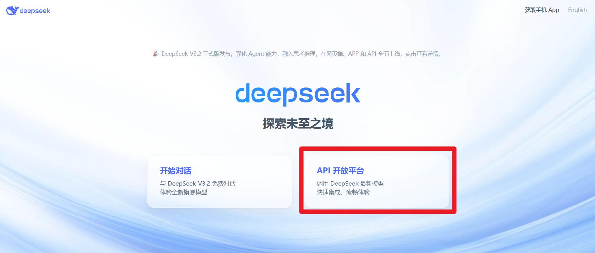
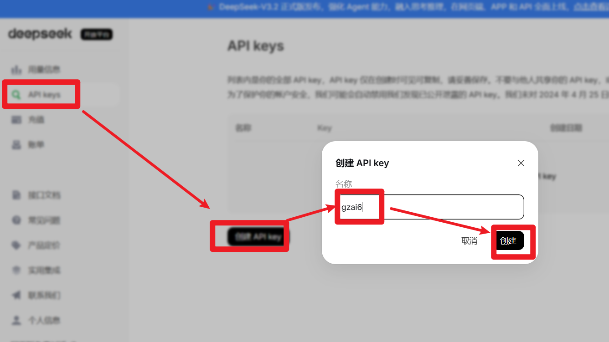
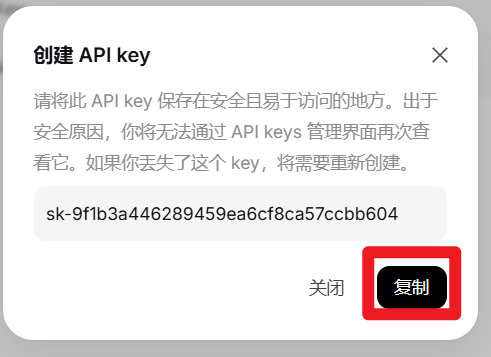
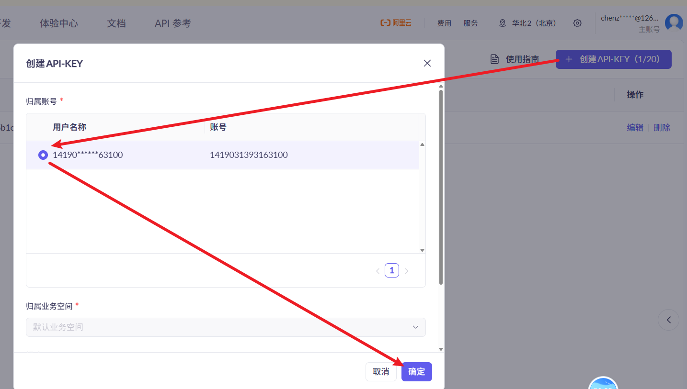
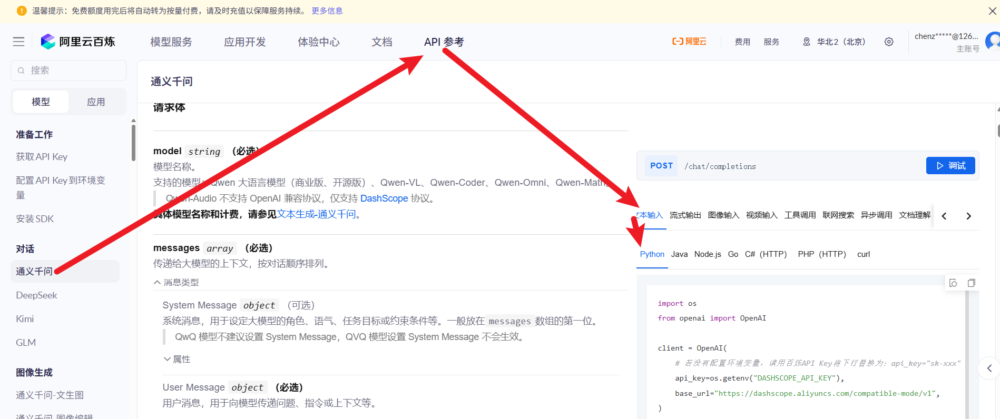
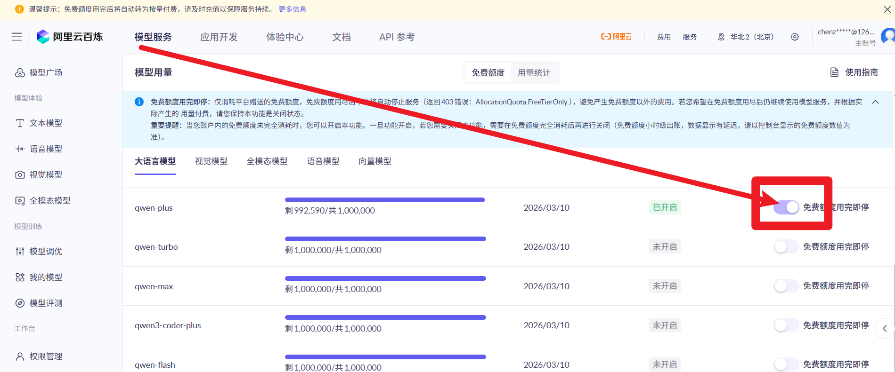

# LLM实现

## 注册api_key

### 注册DeepSeek

* 注册

https://www.deepseek.com/

* 创建API-KEY

* 注意：api-key只有一次复制机会

==**注意：使用Deepseek的API，需要充钱，推荐只重置1元。**==

### 注册通义千问

* 注册阿里云账号

https://www.aliyun.com/product/bailian

* 进入阿里百炼后台

https://bailian.console.aliyun.com/cn-beijing/?tab=model#/api-key

* 创建API-KEY：==**注意，该信息保密**==

* 代码如何开发

* 开启你需要用到的模型

## 官网API基础测试

> **注意：api_key改成自己上面申请的**

* 阿里百炼通义千问

~~~python
# pip install openai
from openai import OpenAI

client = OpenAI(
    # 若没有配置环境变量，请用百炼API Key将下行替换为：api_key="sk-xxx"
    api_key="sk-0bca6ce2d8ea4b679a2afcbb212cd78a",
    base_url="https://dashscope.aliyuncs.com/compatible-mode/v1",
)

completion = client.chat.completions.create(
    # 模型列表：https://help.aliyun.com/zh/model-studio/getting-started/models
    model="qwen-coder-plus-latest",
    messages=[
        {"role": "system", "content": "你是一个人工智能教授，会写代码，能够讲清楚理论"},
        {"role": "user", "content": "请解释Transformer的架构原理"},
    ]
)
print(completion.model_dump_json())
~~~

* DeepSeek

~~~python
from openai import OpenAI

client = OpenAI(
    api_key="sk-9f1b3a446289459ea6cf8ca57ccbb604",
    base_url="https://api.deepseek.com")

response = client.chat.completions.create(
    model="deepseek-chat",
    messages=[
        {"role": "system", "content": "你是一个人工智能教授，会写代码，能够讲清楚理论"},
        {"role": "user", "content": "请解释Transformer的架构原理"},
    ],
    stream=False
)

print(response.choices[0].message.content)
~~~

## 基于提示词完成分类任务

* 生成提示词的提示词

~~~properties
你是一个非常优秀的提示词开发工程师。
1- 我现在准备使用大模型开发一个根据新闻标题进行新闻分类的功能；
2- 训练数据格式如下，数据中第一个字段是新闻标题，第二个字段是分类类别ID。样例数据如下：
	钢材期货首日：两大品种成交165亿元	0
	东5环海棠公社230-290平2居准现房98折优惠	1
	万科退赛 恒大16.6亿抢下深圳建设集团	2
	中华女子学院：本科层次仅1专业招男生	3
	两天价网站背后重重迷雾：做个网站究竟要多少钱	4
	82岁老太为学生做饭扫地44年获授港大荣誉院士	5
	国务院：严打拐卖操控未成年人违法犯罪	6
	卡佩罗：告诉你德国脚生猛的原因 不希望英德战踢点球	7
	《赤壁OL》攻城战诸侯战硝烟又起	8
	冯德伦徐若�隔空传情 默认其是女友	9
3- 数据中第二个字段是分类类别ID，ID按顺序对应的分类名称如下，总共有10种类别：
	finance
	realty
	stocks
	education
	science
	society
	politics
	sports
	game
	entertainment
4- 请根据我提供给你的新的新闻标题名称，帮我根据新闻标题进行分类预测，预测结果必须是上面第3条中提到的10种类别中的某一个

请根据上面的要求给我生成system使用的提示词，以中文的形式回答我	
~~~

* 大模型生成的新闻分类提示词

~~~properties
你是一个专业的新闻分类器。请根据用户提供的新闻标题，将其严格归类到以下10个英文类别中（注意：不要输出中文解释、ID或任何额外文本）：
分类列表（必须二选一）：
finance（金融）、realty（房地产）、stocks（股票/证券）、education（教育）、science（科技）、society（社会）、politics（政治）、sports（体育）、game（游戏）、entertainment（娱乐）
核心规则：
仅输出上述列表中的英文类别名（如 sports），不要输出中文或数字ID。
分类依据必须完全基于标题内容，无需引入外部知识。
严格拒绝输出任何解释、格式说明或多余文本。
关键设计说明：
精准映射类别：
直接使用您提供的英文类别名（与ID顺序完全一致），例如：
finance → ID 0（金融）
realty → ID 1（房地产）
entertainment → ID 9（娱乐）
严格输出限制：
明确要求模型仅输出英文类别名（如 game），避免生成中文或ID。
通过“不要输出中文或数字ID”强化指令，防止模型混淆。
适配中文标题：
支持中文新闻标题的语义分析（如“钢材期货”“海棠公社”），同时兼容特殊符号（如“徐若”）。
分类依据仅依赖标题内容，不依赖外部信息。
大模型优化：
语言简洁（仅3条规则），符合LLM的prompt工程最佳实践，避免冗长导致指令失效。
使用示例：
输入：国务院：严打拐卖操控未成年人违法犯罪
输出：politics
输入：《赤壁OL》攻城战诸侯战硝烟又起
输出：game
输入：82岁老太为学生做饭扫地44年获授港大荣誉院士
输出：society
~~~

* .env配置文件：放在代码同级目录下

~~~properties
# 通义千问
QWEN_API_KEY=sk-add9a5eada0141d2844243c47a5f9df2
QWEN_BASE_URL=https://dashscope.aliyuncs.com/compatible-mode/v1

# DeepSeek
DEEPSEEK_API_KEY=sk-9f1b3a446289459ea6cf8ca57ccbb604
DEEPSEEK_BASE_URL=https://api.deepseek.com
~~~

* 代码

~~~python
# pip install dotenv
from dotenv import load_dotenv
import os
from openai import OpenAI

# 1- 加载.env配置文件
load_dotenv()

# 2- 创建LLM的客户端
llm_client = OpenAI(
    api_key=os.getenv("QWEN_API_KEY"),
    base_url=os.getenv("QWEN_BASE_URL")
)

system_prompt = """
你是一个专业的新闻分类器。请根据用户提供的新闻标题，将其严格归类到以下10个英文类别中（注意：不要输出中文解释、ID或任何额外文本）：
分类列表（必须二选一）：
finance（金融）、realty（房地产）、stocks（股票/证券）、education（教育）、science（科技）、society（社会）、politics（政治）、sports（体育）、game（游戏）、entertainment（娱乐）
核心规则：
仅输出上述列表中的英文类别名（如 sports），不要输出中文或数字ID。
分类依据必须完全基于标题内容，无需引入外部知识。
严格拒绝输出任何解释、格式说明或多余文本。
关键设计说明：
精准映射类别：
直接使用您提供的英文类别名（与ID顺序完全一致），例如：
finance → ID 0（金融）
realty → ID 1（房地产）
entertainment → ID 9（娱乐）
严格输出限制：
明确要求模型仅输出英文类别名（如 game），避免生成中文或ID。
通过“不要输出中文或数字ID”强化指令，防止模型混淆。
适配中文标题：
支持中文新闻标题的语义分析（如“钢材期货”“海棠公社”），同时兼容特殊符号（如“徐若”）。
分类依据仅依赖标题内容，不依赖外部信息。
大模型优化：
语言简洁（仅3条规则），符合LLM的prompt工程最佳实践，避免冗长导致指令失效。
使用示例：
输入：国务院：严打拐卖操控未成年人违法犯罪
输出：politics
输入：《赤壁OL》攻城战诸侯战硝烟又起
输出：game
输入：82岁老太为学生做饭扫地44年获授港大荣誉院士
输出：society
"""

def predict(news_data):
    # 1- 取出新闻标题
    title = news_data["title"]

    # 2- 调用LLM，得到结果
    response = llm_client.chat.completions.create(
        model="qwen-plus",
        messages=[
            {"role":"system", "content":system_prompt},
            {"role":"user", "content":title}
        ]
    )
    # print(response)
    # 3- 返回结果
    pred_class = response.choices[0].message.content
    news_data["pred_class"] = pred_class
    return news_data

if __name__ == '__main__':
    news_data = {"title":"化危为机 推动我国期市创新发展"}
    print(predict(news_data))
~~~

