# 模型压缩

## 介绍

目的：在对模型的==性能影响不大==的前提下，尽可能减小模型的占用空间，减少模型参数量，让模型变得简单，==提升运行速度==。

分类：

* 模型量化
* 模型蒸馏
* 模型剪枝
* 低秩分解

## 方式对比

~~~properties
剪枝、蒸馏、量化的使用顺序：
	1- 如果偏向于减小模型体积，重点使用蒸馏
	2- 如果在模型体积减小的同时，模型效果不允许出现大程度的下降，推荐使用量化
	3- 先剪枝或者先量化，然后再蒸馏
~~~

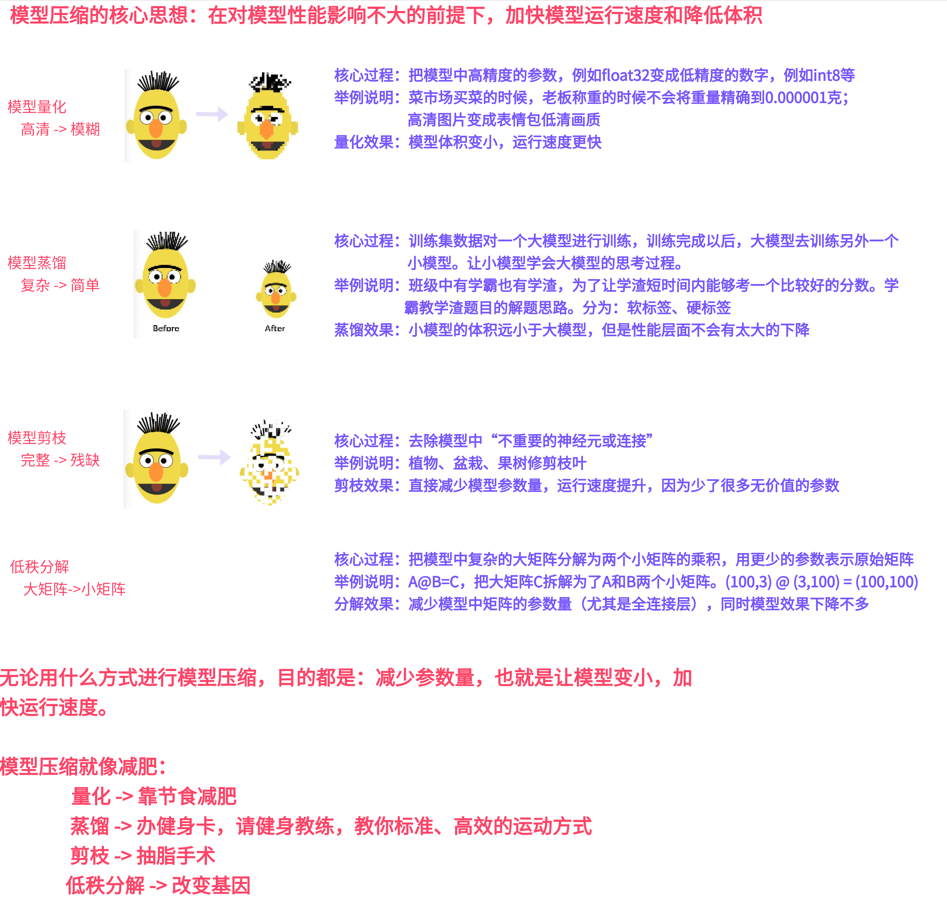

## 模型量化

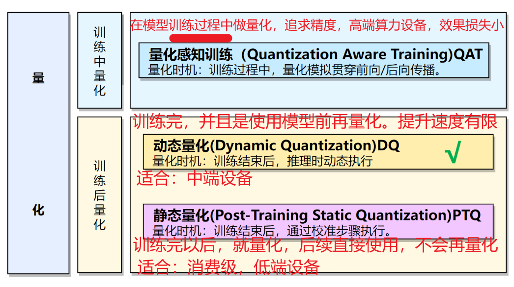

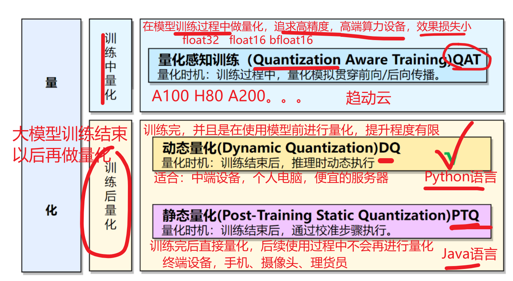

~~~properties
QAT、DQ、PTQ它们三个都是量化的具体实现，也就是它们的核心目的一样：在对模型效果影响不大的情况下，通过降低参数的精度也就是数据类型，来达到减小模型体积和提高运行速度。
~~~

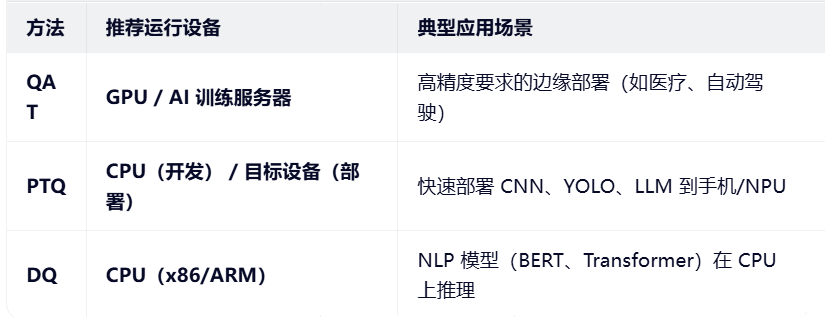

量化代码实现

~~~python
# 注意：DQ推荐在CPU环境下运行
from config import Config
from bert_model import BertClassifierModel
import torch
from bert_train_and_eval import eval_model

if __name__ == '__main__':
    # 1- 【了解】查看支持的量化引擎
    """
        量化引擎：
            none：没有硬件加速
            onednn：英特尔深度学习
            x86：x86架构的服务器进行优化
            fbgemm：FaceBook的量化计算引擎
    """
    print("支持的量化引擎：",torch.backends.quantized.supported_engines)

    # 2- 【了解】显示设置量化引擎：onednn
    # 上面两行代码了解的原因是：代码会自动根据你的环境自动的决定用什么量化引擎
    torch.backends.quantized.engine = "onednn"

    # 3- 基础配置
    config = Config()

    # 4- 量化前
    # 加载模型
    model = BertClassifierModel()
    # map_location：加载到CPU上。DQ推荐在CPU环境运行
    model.load_state_dict(torch.load(config.save_model,map_location="cpu"))
    model.eval()
    f1score, accuracy, precision, recall = eval_model(model)
    print(f"量化前的指标{f1score}，{accuracy}，{precision}，{recall}")

    # 5- 量化后
    # 【DQ量化核心代码】
    """
        参数解释：
            model：要量化的模型对象
            qconfig_spec：要对模型中的什么网络层进行量化
            dtype：将网络层中的参数缩小到什么数据类型
    """
    quantization_model = torch.quantization.quantize_dynamic(model,qconfig_spec={torch.nn.Linear},dtype=torch.qint8)
    quantization_model.eval()
    f1score2, accuracy2, precision2, recall2 = eval_model(quantization_model)
    print(f"量化后的指标{f1score2}，{accuracy2}，{precision2}，{recall2}")

    # 保存量化后的模型
    torch.save(quantization_model,"save_model/quantization_model.pkl")
~~~

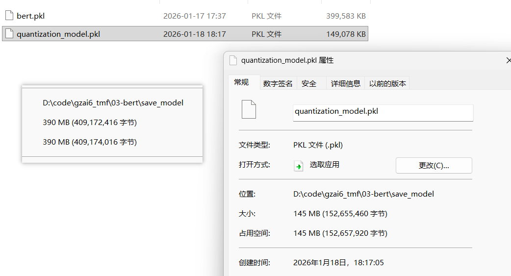

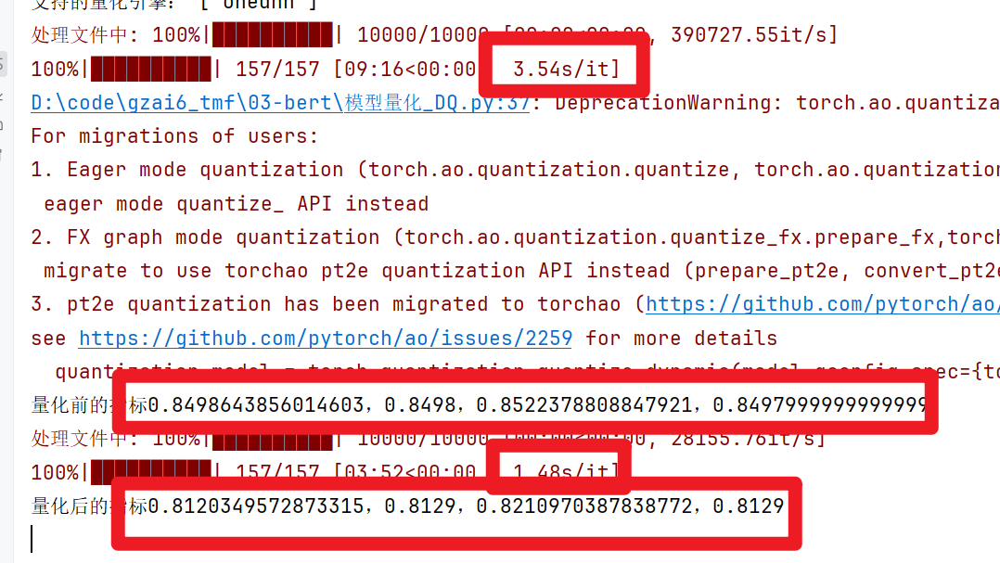

## 模型蒸馏

### 五个概念

~~~properties
教师模型：是一个大模型，参数量大，预测精确，但是运行速度慢，模型体积大
学生模型：是一个小模型，参数量少，预测相对精确，但是运行速度快，模型体积小

硬标签：模型预测结果的概率值，非0即1。学生模型只能学到有限的内容，只能学到一个最终的答案
软标签：模型预测结果的概率值，取值区间在[0,1]之间。学生模型能够学到预测结果的概率分布
中间层：模型的思考过程。通过MSE损失函数，评估教师模型与学生模型之间的误差。
~~~

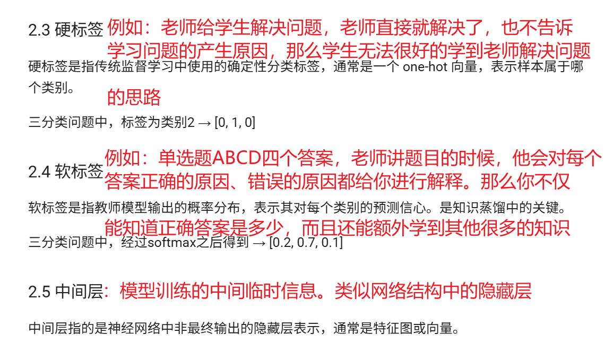

### 整体原理

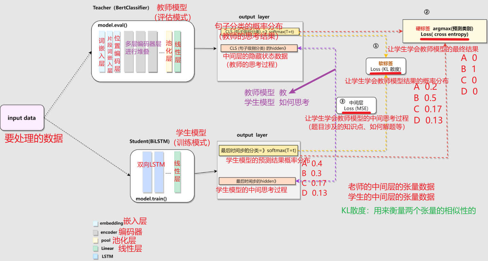

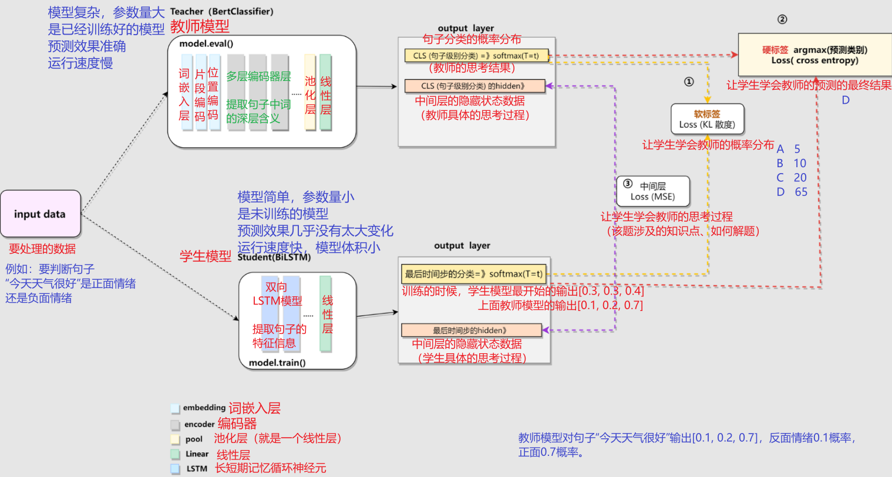

### KL散度

~~~properties
KL散度介绍【面试问题】：
	1- 作用：衡量两个预测概率分布之间的差异性
	2- 规律：该值越小越好。最小为0，那么说明学生模型和教师模型的结果完全一样，蒸馏效果最好
	3- 扩展：硬标签中 KL散度值=交叉熵，因为信息熵带入预测分布概率进去H(P)结果是0
	
记住: KL 散度就是“我们⽤⼀个分布去模仿另⼀个分布，结果差多少”的⼀个衡量⽅式。
~~~

### 软标签的两个超参数

~~~properties
T超参数：
	1- 如果 T = 1：就是普通 softmax；
	2- 如果 T 趋近于 0：softmax 趋近 one-hot，更像硬标签。
	3- 如果 T 趋近于⽆穷⼤：softmax 趋近于均匀的分布。
	4- ⼀般 T选2到5之间，太⾼或太低都可能让学⽣难以学习。设置到2

α超参数：
	1- α 趋近 1：更重视 teacher 的软标签（偏向模仿⽼师）
	2- α 趋近 0：更重视 ground truth 的硬标签（偏向传统训练）
	3- ⼀般α设置在0.5到0.9之间。0.7
~~~

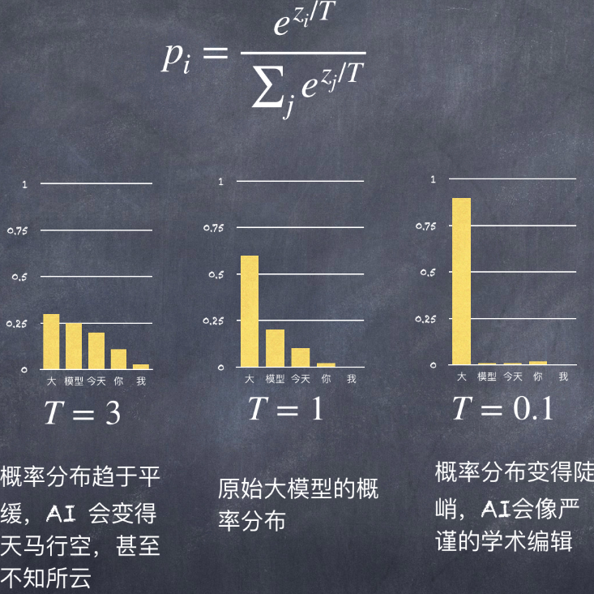

### 代码开发

#### 代码结构

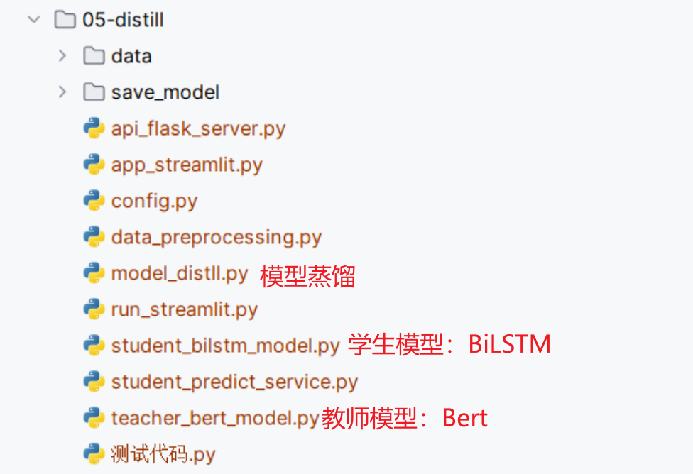

#### 配置文件

~~~python
import torch

class Config:
    def __init__(self):
        # 1- 设备
        self.device = ("cuda" if torch.cuda.is_available() else "cpu")

        # 2- 原始文件路径
        self.train_datapath = "data/train.txt"
        self.dev_datapath = "data/dev.txt"
        self.test_datapath = "data/test.txt"
        self.class_datapath = "data/class.txt"

        # 3- 数据加载器参数
        self.batch_size = 64    # 64条新闻
        self.max_length = 32    # 句子中词的个数最多是32个词

        # 4- Bert预训练模型的路径
        self.bert_path = r"D:\soft\PretrainedModel\bert-base-chinese"

        # 5- 目标值文件解析
        self.classname_list = [line.strip() for line in open(self.class_datapath,mode="r",encoding="UTF-8")]
        self.classname_len = len(self.classname_list)

        # 6- 训练好的【教师模型】的保存路径
        self.teacher_save_model = "save_model/teacher_bert.pkl"

        # 7- 训练好的【学生模型】的保存路径
        self.student_save_model = "save_model/student_bert.pkl"

if __name__ == '__main__':
    config = Config()
    print(config.classname_list)
    print(config.classname_len)
~~~

#### 教师模型

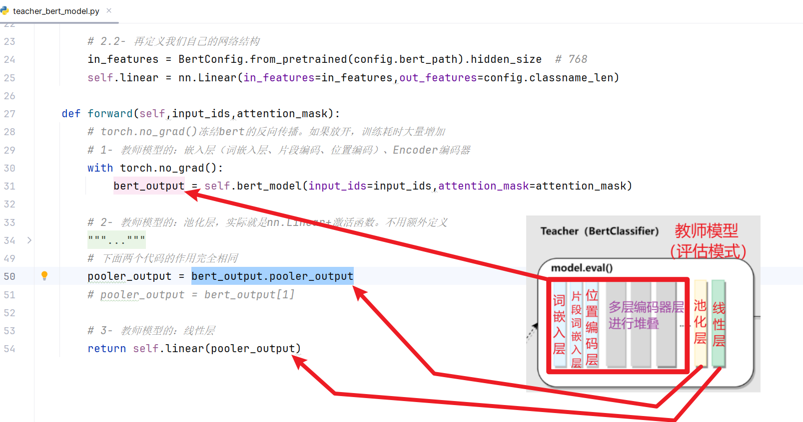

~~~python
# 教师模型：Bert预训练模型
import torch
import torch.nn as nn
from config import Config
from transformers import BertModel
from transformers import BertConfig

config = Config()

class BertTeacherModel(nn.Module):
    def __init__(self):
        # 1- 初始化父类
        super().__init__()

        # 2- 搭建网络结构
        # 2.1- 先定义Bert模型
        self.bert_model = BertModel.from_pretrained(config.bert_path)

        # 2.2- 再定义我们自己的网络结构
        in_features = BertConfig.from_pretrained(config.bert_path).hidden_size  # 768
        self.linear = nn.Linear(in_features=in_features,out_features=config.classname_len)

    def forward(self,input_ids,attention_mask):
        # torch.no_grad()冻结bert的反向传播。如果放开，训练耗时大量增加
        # 1- 教师模型的：嵌入层（词嵌入层、片段编码、位置编码）、Encoder编码器
        with torch.no_grad():
            bert_output = self.bert_model(input_ids=input_ids,attention_mask=attention_mask)

        # 2- 教师模型的：池化层，实际就是nn.Linear+激活函数。不用额外定义
        """
            1- last_hidden_state[:,0]和pooler_output的区别。
            区别：需要对last_hidden_state[:,0]经过nn.Linear和激活函数处理后，才能得到pooler_output
            对应源代码位置：BertModel文件的697行
            
            2- 使用pooler_output的原因
            语义对齐：pooler_output已经是经过精心设计的句子级表示，与下游任务对齐
            降维简化：从 seq_len × hidden_dim 降到 hidden_dim，大幅降低学习难度
            去除噪声：避免了学习padding位置和无关token的表示
            
            3- 获得池化层后的结果有两种方式：
                2.1- 方式一：推荐。通过实例属性获得 bert_output.pooler_output
                2.2- 方式二：通过实例属性索引获得 bert_output[1]。1的原因是pooler_output是类中的第2个实例属性
                            对应源代码位置：BertModel文件的1017行
        """
        # 下面两个代码的作用完全相同
        pooler_output = bert_output.pooler_output
        # pooler_output = bert_output[1]

        # 3- 教师模型的：线性层
        return self.linear(pooler_output)
~~~

#### 学生模型

~~~python
import torch
from torch import Tensor

from config import Config
import torch.nn as nn
from transformers import BertConfig

config = Config()
bert_config = BertConfig.from_pretrained(config.bert_path)

class BiLSTMStudentModel(nn.Module):
    def __init__(self):
        # 1- 初始化父类
        super().__init__()

        # 2- 设置属性值
        self.vocab_size = bert_config.vocab_size
        self.embedding_dim = 128
        self.hidden_size = 256
        self.num_layers = 3

        # 3- 搭建网络结构
        # 3.1- 词嵌入层
        # embedding_dim：由我们自己设置，与教师模型没有任何关系
        self.embedding = nn.Embedding(num_embeddings=self.vocab_size,embedding_dim=self.embedding_dim)

        # 3.2- 循环神经网络层：BiLSTM
        """
            参数解释：
                input_size：输入的词向量维度。必须和上面的embedding_dim相同
                hidden_size：隐藏层向量维度。大小自定义
                num_layers：隐藏层的层数。大小自定义，与是否是双向无关
                batch_first：输入和输出的数据中，batch_size是否在张量的第一个位置上
                bidirectional：是否是双向LSTM
        """
        self.lstm = nn.LSTM(
            input_size=self.embedding_dim,
            hidden_size=self.hidden_size,
            num_layers=self.num_layers,
            batch_first=True,
            bidirectional=True
        )

        # 3.3- 随机失活层
        self.dropout = nn.Dropout(p=0.3)

        # 3.4- 线性层
        """
            为什么是self.hidden_size*2？
            答：因为是双向的LSTM。双向的LSTM执行完以后，会将两个方向的隐藏状态信息进行concat拼接，形状变成两倍了
        """
        self.linear = nn.Linear(in_features=self.hidden_size*2,out_features=config.classname_len)

    def forward(self,input_ids, attentition_mask):
        """
        :param input_ids: 句子中词索引
        :param attentition_mask: 输入句子的掩码
        :return:
        """

        # 1- 调用词嵌入层，得到词向量
        # 张量形状：[batch_size, seq_len, embedding_dim]
        ebd = self.embedding(input_ids)

        # 2- 对词向量进行掩码操作：最终目的是只对正常词进行处理，句子开头、句子结尾、padding填充的0这三者不关心
        # 排除特殊标记：[CLS]和[SEP]不包含实际语义，不应参与句子表示
		# 排除填充标记：[PAD]是占位符，必须被排除
        cls_token_index = 101   # 句子开头
        sep_token_index = 102   # 句子结尾
        ebd_mask = (input_ids!=cls_token_index) & (input_ids!=sep_token_index)
        ebd_mask:Tensor = ebd_mask & attentition_mask

        # 对词向量进行掩码操作
        # [batch_size, seq_len] 升维至 [batch_size, seq_len, 1]
        ebd_mask = ebd_mask.unsqueeze(-1)
        ebd = ebd * ebd_mask

        # 3- 调用循环神经网络BiLSTM
        # 为什么调用lstm的时候，没有手动传递初始的细胞状态和隐藏状态：LSTM内部会自动的进行全0初始化。源代码在1056行
        output,(hidden,c) = self.lstm(ebd)

        # 4- 计算平均池化值
        """
            下面两个地方都是sum(dim=1)的原因：
                1- output的张量形状[batch_size,seq_len,hidden_size]
                2- 我们的业务需求是对句子进行分类，因此主体是句子
                3- sum(dim=1)得到的结果形状[batch_size,hidden_size]。形状的含义是把一条句子中所有词的词向量加起来，
                    得到句子级别的向量总和
                    
        """
        # 分子：所有有效的词的向量之和
        output_sum = output.sum(dim=1)
        # 分母：所有有效的词总数。1e-6为了防止分母为0
        token_count = ebd_mask.sum(dim=1) + 1e-6
        new_output = output_sum/token_count

        # 5- 调用线性层，得到预测结果，并返回
        return self.linear(self.dropout(new_output))

if __name__ == '__main__':
    # 编写测试数据
    input_ids = torch.LongTensor([[101, 2, 3, 4, 5], [4, 102, 6, 7, 8]])
    attention_mask = torch.LongTensor([[1, 1, 1, 1, 0], [1, 1, 0, 0, 0]])
    model = BiLSTMStudentModel()
    print(model(input_ids, attention_mask))
~~~

* **forward中掩码测试代码**

~~~python
import torch

if __name__ == '__main__':
    cls_token_index = 3  # 句子开头
    sep_token_index = 4  # 句子结尾

    input_ids = torch.randint(low=1,high=6,size=(2,5))
    attentition_mask = torch.randint(low=0,high=2,size=(2,5))

    print(f"输入的句子词索引input_ids：\n{input_ids}")
    print(f"输入的句子掩码attentition_mask：\n{attentition_mask}")

    ebd_mask = (input_ids != cls_token_index) & (input_ids != sep_token_index)
    print(f"输入的句子处理后的掩码ebd_mask_1：\n{ebd_mask}")

    ebd_mask = ebd_mask & attentition_mask
    print(f"输入的句子处理后的掩码ebd_mask_2：\n{ebd_mask}")

    print("-"*30)

    ebd_mask = ebd_mask.unsqueeze(-1)
    ebd = torch.randint(low=1,high=10,size=(2,5,4))
    print(f"词向量的掩码ebd_mask：\n{ebd_mask}")
    print(f"前_词向量ebd：\n{ebd}")

    ebd = ebd * ebd_mask
    print(f"后_词向量ebd：\n{ebd}")

    print("1   ", ebd.sum(dim=1))
    print("1   ", ebd.sum(dim=1).shape)
    print("-1  ", ebd.sum(dim=-1).shape)
~~~

#### 模型蒸馏

~~~python
from config import Config
from data_preprocessing import build_dataloader
from teacher_bert_model import BertTeacherModel # 教师模型
from student_bilstm_model import BiLSTMStudentModel # 学生模型
import torch
import torch.nn as nn
from tqdm import tqdm
from sklearn.metrics import accuracy_score,precision_score,recall_score,f1_score

config = Config()

def eval_model(model):
    # 1- 加载验证集数据
    dev_dataloader = build_dataloader(datapath=config.dev_datapath,shuffle=False)

    # 2- 模型评估
    # 2.1- 定义用来计算准确率的变量
    all_pred_result = []    # 预测结果列表
    all_true_result = []    # 真实结果列表

    model.eval()
    with torch.no_grad():
        for i,batch in enumerate(tqdm(dev_dataloader), start=1):
            # 2.2- 将数据发送到对应设备
            input_ids, attention_mask, labels = batch
            input_ids = input_ids.to(config.device)
            attention_mask = attention_mask.to(config.device)
            labels = labels.to(config.device)

            # 2.3- 前向传播：预测
            pred_output = model(input_ids,attention_mask)
            pred_index = torch.argmax(pred_output,dim=-1)
            # cpu()：因为不涉及张量的计算，因此为了节约GPU资源，可以将数据转到CPU上再处理
            all_pred_result.extend(pred_index.cpu().tolist())
            all_true_result.extend(labels.cpu().tolist())

    # 3- 计算评估指标
    f1score = f1_score(all_true_result,all_pred_result,average="macro")
    # 准确率
    accuracy = accuracy_score(all_true_result,all_pred_result)
    precision = precision_score(all_true_result,all_pred_result,average="macro")
    recall = recall_score(all_true_result,all_pred_result,average="macro")

    return f1score, accuracy, precision, recall

def train_and_eval():
    # 1- 加载数据
    train_dataloader = build_dataloader(datapath=config.train_datapath,shuffle=True)

    # 2- 创建模型
    # 2.1- 加载训练好的教师模型
    teacher_model = BertTeacherModel().to(config.device)
    teacher_model.load_state_dict(torch.load(config.teacher_save_model))
    # 2.2- 新建学生模型
    student_model = BiLSTMStudentModel().to(config.device)

    # 3- 损失函数对象
    loss = nn.CrossEntropyLoss()

    # 4- 优化器对象
    optimizer = torch.optim.AdamW(params=student_model.parameters(),lr=5e-5)

    # 5- 其他变量
    epochs = 1
    best_f1score = 0.0  # f1历史最高分
    T = 2   # 超参数：温度
    alpha = 0.7 # 超参数：软标签权重

    # 6- 训练
    # 6.1- 模型模式设置
    teacher_model.eval()    # 注意：教师模型是已经训练好了，不允许更新参数
    student_model.train()   # 注意：学生模型还未训练

    for epoch in range(epochs):
        for i,batch in enumerate(tqdm(train_dataloader),start=1):
            # 6.2- 将训练数据发送到设备
            input_ids, attention_mask, labels = batch
            input_ids = input_ids.to(config.device)
            attention_mask = attention_mask.to(config.device)
            labels = labels.to(config.device)

            # 6.3- 教师模型_前向传播
            with torch.no_grad():
                teacher_pred = teacher_model(input_ids,attention_mask)
                teacher_pred_labels = torch.argmax(teacher_pred,dim=-1)

            # 6.4- 学生模型_前向传播
            student_pred = student_model(input_ids, attention_mask)
            student_pred_labels = torch.argmax(student_pred, dim=-1)

            # 6.5- 计算KL散度值
            p = torch.log_softmax(teacher_pred/T, dim=-1)
            q = torch.log_softmax(student_pred/T, dim=-1)
            # KL散度值，也就是软标签的值
            """
                注意：kl_div的包不要导错了！！！
                参数解释：
                    input：是【学生模型】输出的结果
                    target：预测结果参考值。也就是【教师模型】输出的结果
                    reduction：上面两个值的计算方式。
                    log_target：是否对计算结果求log对数
            """
            kl_value = torch.nn.functional.kl_div(
                input=q,
                target=p,
                reduction="batchmean",
                log_target=True
            )

            # 6.6- 硬标签损失值
            # 注意：是学生模型的预测概率，与样本的目标值算损失
            hard_label_loss = loss(student_pred,labels)

            # 6.7- 蒸馏的总损失值
            # l = (1-α) * 硬标签损失值 + α * T² * KL散度值
            distll_loss = (1 - alpha) * hard_label_loss + alpha * (T**2) * kl_value

            # 6.8- 固定代码
            optimizer.zero_grad()
            distll_loss.sum().backward()
            optimizer.step()

            # 6.9- 每隔100个批次或最后一个批次，对学生模型进行验证
            if i%100==0 or i==len(train_dataloader):
                # 6.9.1- 调用评估函数
                f1score, accuracy, precision, recall = eval_model(student_model)
                print(f"第{i}批次，f1score={f1score}，accuracy={accuracy}，precision={precision}，recall={recall}")

                # 6.9.2- 如果验证后发现模型效果有提升（也就是f1score比上次的要大），那就保存模型
                if f1score>best_f1score:
                    torch.save(student_model.state_dict(),config.student_save_model)
                    best_f1score = f1score  # 更新历史最高分

                # 6.9.3- 将模型的模式切回为训练模式
                student_model.train()

if __name__ == '__main__':
    train_and_eval()
~~~

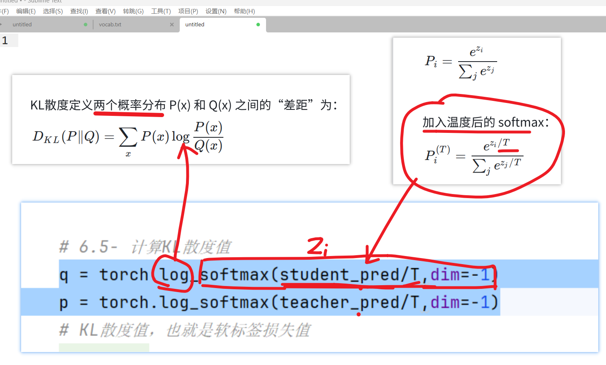

蒸馏结果：

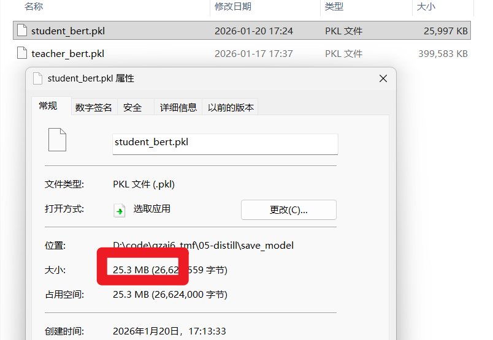

#### 模型预测

~~~python
from config import Config
from student_bilstm_model import BiLSTMStudentModel
from transformers import BertTokenizer
import torch

# 1- 加载训练好的模型
config = Config()

model = BiLSTMStudentModel().to(config.device)
# 注意：不要用变量接受返回结果
model.load_state_dict(torch.load(config.student_save_model))
tokenizer = BertTokenizer.from_pretrained(config.bert_path)

model.eval()

# 2- 预测函数
def predict(news_data):
    # 数据预处理
    title = news_data["title"]
    # 注意：这里用的是batch_encode_plus，而title只有1条新闻，因此下面的参数需要使用中括号包起来
    data_tensor = tokenizer.batch_encode_plus(
        [title],
        padding="max_length",
        truncation=True,
        max_length=config.max_length
    )

    input_ids = torch.tensor(data_tensor.input_ids).to(config.device)
    attention_mask = torch.tensor(data_tensor.attention_mask).to(config.device)

    # 模型预测
    with torch.no_grad():
        # 前向传播：预测
        pred_output = model(input_ids,attention_mask)
        # 获得概率最高的分类索引
        pred_index = torch.argmax(pred_output,dim=-1).item()
        # 索引转成类别名称
        pred_class_name = config.classname_list[pred_index]

    # 返回结果
    news_data["pred_class"] = pred_class_name

    return news_data

if __name__ == '__main__':
    print(predict({"title": "体验2D巅峰 倚天屠龙记十大创新概览"}))
~~~

#### 前后端

略

## 模型剪枝

### 介绍

~~~properties
作用：主要是为了去除神经网络中不重要或者冗余的神经元、连接，甚至整个网络层
特点：对模型体积的减小和模型运行速度的提升，微乎其微
使用：剪枝后，一般会和其他的模型压缩手段配合使用
~~~

### 剪枝核心代码

~~~python
# 模型剪枝：最核心代码
# 需求：BERT 全局非结构化剪枝：对所有 encoder 层注意力权重剪枝 30%，L1 范数
from data_preprocessing import build_dataloader
from model_eval import eval_model
from config import Config
from bert_model import BertClassifierModel
import torch
from torch.nn.utils import prune    # 模型剪枝方法

if __name__ == '__main__':
    config = Config()
    dev_dataloader = build_dataloader(config.dev_datapath,shuffle=False)
    num_layers = 12 # bert-base-chinese中编码器层有12层

    # 1- 剪枝前
    # 1.1- 加载训练好的模型
    model = BertClassifierModel().to(device=config.device)
    model.load_state_dict(torch.load(config.before_prune_path))
    # 1.2- 验证模型
    f1score, accuracy, precision, recall = eval_model(model)
    print(f"剪枝前，f1score={f1score}，accuracy={accuracy}，precision={precision}，recall={recall}")

    # 2- 【理解】剪枝中
    # 2.1- 规定对Bert模型中什么层的什么参数进行剪枝
    """
        代码解释：
            1- before_prune_model.bert_model.encoder.layer[layer_index].attention.self：
                对模型中 12个编码器层 中的 多头自注意力子层 进行剪枝
            2- multi_self_atten.query、key、value 多头自注意力子层 中的 q、k、v 的 权重w 进行剪枝
    """
    parameters_to_prune = []
    for layer_index in range(num_layers):
        multi_self_atten = model.bert_model.encoder.layer[layer_index].attention.self
        parameters_to_prune.extend([
            (multi_self_atten.query,"weight"),
            (multi_self_atten.key,"weight"),
            (multi_self_atten.value,"weight")
        ])

    # 2.2- 进行全局非结构化剪枝
    """
        参数解释：
            parameters：剪枝范围。也就是规定对Bert模型中什么层的什么参数进行剪枝
            pruning_method：剪枝方式
            amount：剪枝的参数情况。有两种类的参数值，如下
                整数：表示具体对多少个参数剪枝
                小数：表示对Bert模型中多大比例的参数进行剪枝。推荐
    """
    prune.global_unstructured(
        parameters=parameters_to_prune,
        pruning_method=prune.L1Unstructured,
        amount=0.3
    )

    # 2.3- 固化剪枝后的模型：将剪枝后的权重持久化存储到模型结构中
    for param_name,param_type in parameters_to_prune:
        prune.remove(param_name,param_type)

    # 3- 剪枝后
    # 3.1- 验证模型
    f1score, accuracy, precision, recall = eval_model(model)
    print(f"剪枝后，f1score={f1score}，accuracy={accuracy}，precision={precision}，recall={recall}")

    # 3.2- 保存剪枝后的模型
    torch.save(model.state_dict(),config.after_prune_path)
~~~

### 观察剪枝前后的参数变化

~~~python
# 模型剪枝：最核心代码
# 需求：BERT 全局非结构化剪枝：对所有 encoder 层注意力权重剪枝 30%，L1 范数
from data_preprocessing import build_dataloader
from model_eval import eval_model
from config import Config
from bert_model import BertClassifierModel
import torch
from torch.nn.utils import prune    # 模型剪枝方法

# 打印权重稀疏度
def compute_sparsity(model):
    """
    计算权重稀疏度
    :param model:
    :return: 稀疏度
    """
    total_params = 0    # Bert预训练模型中参数中个数
    zero_params = 0     # 剪枝后参数值为0的参数个数
    layer_num = len(model.bert_model.encoder.layer)

    for i in range(layer_num):
        weight = model.bert_model.encoder.layer[i].attention.self.query.weight
        total_params += weight.numel()  # 获得权重张量中的参数个数
        zero_params += (weight == 0).sum().item()
    return (zero_params*100.0 / total_params) if total_params > 0 else 0

def print_weights(weight, name, rows=5, cols=5):
    """
    打印权重前n行，前n列
    :param weight: 权重
    :param name: 名称
    :param rows: 前rows行
    :param cols: 前clos列
    :return:
    """
    print(f"\n{name}（前 {rows}x{cols}）：")
    print(weight[:rows, :cols])

if __name__ == '__main__':
    config = Config()
    dev_dataloader = build_dataloader(config.dev_datapath,shuffle=False)
    num_layers = 12 # bert-base-chinese中编码器层有12层

    # 1- 剪枝前
    # 1.1- 加载训练好的模型
    model = BertClassifierModel().to(device=config.device)
    model.load_state_dict(torch.load(config.before_prune_path))
    # 1.2- 验证模型
    f1score, accuracy, precision, recall = eval_model(model)
    print(f"剪枝前，f1score={f1score}，accuracy={accuracy}，precision={precision}，recall={recall}")
    # 1.3- 打印参数信息
    zero_param_rate = compute_sparsity(model)
    print(f"剪枝前 参数值为0的占比{zero_param_rate}")
    # 只对编码器层中第一层的query的权重进行抽样展示
    print_weights(weight=model.bert_model.encoder.layer[0].attention.self.query.weight,name="剪枝前：权重")

    # 2- 【理解】剪枝中
    # 2.1- 规定对Bert模型中什么层的什么参数进行剪枝
    """
        代码解释：
            1- before_prune_model.bert_model.encoder.layer[layer_index].attention.self：
                对模型中 12个编码器层 中的 多头自注意力子层 进行剪枝
            2- multi_self_atten.query、key、value 多头自注意力子层 中的 q、k、v 的 权重w 进行剪枝
    """
    parameters_to_prune = []
    for layer_index in range(num_layers):
        multi_self_atten = model.bert_model.encoder.layer[layer_index].attention.self
        parameters_to_prune.extend([
            (multi_self_atten.query,"weight"),
            (multi_self_atten.key,"weight"),
            (multi_self_atten.value,"weight")
        ])

    # 2.2- 进行全局非结构化剪枝
    """
        参数解释：
            parameters：剪枝范围。也就是规定对Bert模型中什么层的什么参数进行剪枝
            pruning_method：剪枝方式
            amount：剪枝的参数情况。有两种类的参数值，如下
                整数：表示具体对多少个参数剪枝
                小数：表示对Bert模型中多大比例的参数进行剪枝。推荐
    """
    prune.global_unstructured(
        parameters=parameters_to_prune,
        pruning_method=prune.L1Unstructured,
        amount=0.3
    )

    # 2.3- 固化剪枝后的模型：将剪枝后的权重持久化存储到模型结构中
    for param_name,param_type in parameters_to_prune:
        prune.remove(param_name,param_type)

    # 3- 剪枝后
    # 3.1- 验证模型
    f1score, accuracy, precision, recall = eval_model(model)
    print(f"剪枝后，f1score={f1score}，accuracy={accuracy}，precision={precision}，recall={recall}")

    # 3.2- 保存剪枝后的模型
    torch.save(model.state_dict(),config.after_prune_path)

    # 3.3- 打印参数信息
    zero_param_rate = compute_sparsity(model)
    print(f"剪枝后 参数值为0的占比{zero_param_rate}")
    # 只对编码器层中第一层的query的权重进行抽样展示
    print_weights(weight=model.bert_model.encoder.layer[0].attention.self.query.weight, name="剪枝后：权重")
~~~

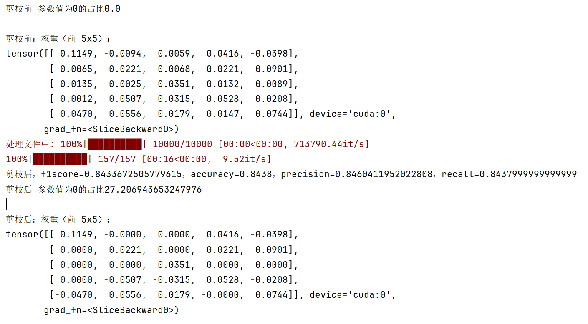

